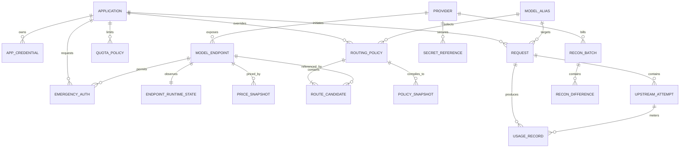

# LLM 网关需求规格说明书 V9

> 文档状态：已确认，可实施 
> 当前阶段：阶段零至阶段七已确认 
> 原始输入：`架构决策实验室架构方案1期-2.pdf` 
> 方法：ontology-driven-dev（需求探索 → 本体建模 → 应用构建）

## 第一部分：项目概述与范围

### 1.1 项目背景

当前约 20 个业务应用分别对接 2 家公有云模型服务和内部模型服务，存在适配器重复开发、密钥分散、重试与流式处理口径不一、成本无法统一核算、供应商故障需要逐应用处置等问题。现有规模约为每日 30 万次请求、峰值 100 QPS，并将扩展到约 50 个业务应用。

本项目建设独立、无状态、至少双副本部署的 LLM Gateway。业务应用只提交应用身份、业务模型别名及 OpenAI 兼容请求参数，不直接感知供应商、上游模型标识和供应商密钥。

### 1.2 建设目标

1. 为约 50 个业务应用提供统一端点和业务模型别名。
2. 将供应商或模型切换收敛为控制面策略变更，不要求业务应用修改代码。
3. 网关同步请求 P95 附加延迟低于 50ms，SSE 首 Token 附加延迟低于 100ms。
4. 仅在首字节返回前执行重试或降级；首字节返回后失败则终止当前流并审计，禁止拼接不同上游输出。
5. 分别记录业务请求和每次上游尝试，按调用时价格快照计费；每日与供应商账单对账，差异率超过 3% 时进入调查。

### 1.3 范围内

- OpenAI 兼容的 Chat Completions 同步及 SSE 流式调用。
- OpenAI 兼容的 Embeddings 调用。
- 基于 LiteLLM Proxy 的数据面能力，同时保持北向协议、业务对象和控制策略产品中立。
- 应用身份认证、业务模型别名、模型路由、超时、首字节前重试、同能力且同数据等级降级。
- 配额、RPM/TPM/并发限流及预算约束。
- 供应商密钥引用、轮换、权限控制和审计；密钥明文由 KMS/Vault 托管。
- 业务请求、上游尝试、Token 用量、调用时价格快照、成本与每日对账。
- OpenTelemetry 指标、日志、链路追踪和运行告警。
- 版本化策略、审批、发布及数据面原子快照加载。
- 关键应用经审批、限时、可审计的应急直连授权。
- 管理端和观测端 UI 原型设计。

### 1.4 范围外

- Prompt 模板和 Prompt 生命周期管理。
- 会话记忆、业务结果投递及异步任务编排。
- RAG、Agent、训练和微调平台。
- 对不同模型输出质量或语义等价性的保证。
- gRPC、供应商私有二进制协议等无法纳入 OpenAI 兼容抽象的接口。
- 业务应用自身的模型效果评估和业务质量验收。

### 1.5 关键边界与约束

- LiteLLM 作为首期数据面实现基线；北向契约、控制面策略和领域模型不绑定 LiteLLM 私有结构。
- 控制面不进入在线请求热路径；数据面使用已发布的不可变策略快照。
- 策略快照过期且无法获取有效新版本时拒绝新请求，不以未知或过期策略继续服务。
- 应用使用 LiteLLM Virtual Key；凭证绑定应用身份，请求方不得通过请求参数冒充其他应用。
- 降级目标必须满足同一 API 能力和不低于当前请求要求的数据安全等级。
- 所有上游计费尝试均进入成本账，业务调用量仍按一个业务请求统计，避免重试造成业务请求重复计数。
- 平台管理员发起策略变更；安全管理员审批密钥及数据等级；SRE 审批路由、降级和限流；FinOps 维护价格与预算。

### 1.6 业务域划分

| 业务域 | 说明 | 候选承载对象 |
|---|---|---|
| 应用接入 | 应用登记、身份认证、凭证生命周期 | OBJ-01、OBJ-02 |
| 模型资源 | 业务别名、供应商、模型部署资源 | OBJ-03、OBJ-04、OBJ-05 |
| 路由治理 | 路由规则、候选目标、策略快照 | OBJ-06、OBJ-07、OBJ-15 |
| 流量治理 | 配额、限流、预算和运行保护 | OBJ-08、OBJ-16 |
| 在线调用 | 业务请求、上游尝试和流式边界 | OBJ-09、OBJ-10 |
| 计量成本 | 用量、价格快照、对账及差异 | OBJ-11、OBJ-12、OBJ-13、OBJ-17 |
| 密钥安全 | 密钥引用、轮换和数据等级约束 | OBJ-14 |
| 应急治理 | 关键应用应急直连授权 | OBJ-18 |
| 审计运维 | 变更、调用和审批审计 | OBJ-19 |

### 1.7 核心清单总览

#### 1.7.1 候选业务对象

| 编号 | 名称 | 阶段零结论 |
|---|---|---|
| OBJ-01 | 应用 | 已确认 |
| OBJ-02 | 应用凭证 | 已确认 |
| OBJ-03 | 业务模型别名 | 已确认 |
| OBJ-04 | 模型供应商 | 已确认 |
| OBJ-05 | 模型部署端点 | 已确认 |
| OBJ-06 | 路由策略 | 已确认 |
| OBJ-07 | 策略快照 | 已确认 |
| OBJ-08 | 配额与限流策略 | 已确认 |
| OBJ-09 | 业务请求 | 已确认 |
| OBJ-10 | 上游尝试 | 已确认 |
| OBJ-11 | 用量记录 | 已确认 |
| OBJ-12 | 价格快照 | 已确认 |
| OBJ-13 | 对账批次 | 已确认 |
| OBJ-14 | 密钥引用 | 已确认 |
| OBJ-15 | 路由候选项 | 已确认（AI 补全） |
| OBJ-16 | 模型运行状态 | 已确认（AI 补全） |
| OBJ-17 | 对账差异 | 已确认（AI 补全） |
| OBJ-18 | 应急直连授权 | 已确认（AI 补全） |
| OBJ-19 | 审计记录 | 已确认（AI 补全） |

#### 1.7.2 候选业务功能

- FUNC-01 应用登记与凭证管理
- FUNC-02 供应商及模型资源管理
- FUNC-03 业务别名与路由策略管理
- FUNC-04 策略提交、审批与发布
- FUNC-05 密钥引用与轮换管理
- FUNC-06 配额、限流与预算管理

#### 1.7.3 候选系统行为

- B-01 校验并绑定应用身份
- B-02 执行配额、限流和预算检查
- B-03 为请求绑定有效策略快照
- B-04 选择上游并发起调用
- B-05 在首字节前执行重试或降级
- B-06 分别记录业务请求与上游尝试
- B-07 按调用时价格快照计算成本
- B-08 执行每日供应商账单对账

#### 1.7.4 候选端到端流程

- PROC-01 在线模型调用
- PROC-02 策略发布
- PROC-03 密钥轮换
- PROC-04 每日成本对账
- PROC-05 供应商故障处置

#### 1.7.5 候选审批流

- PROC-APP-01 策略变更审批
- PROC-APP-02 密钥轮换审批
- PROC-APP-03 应急直连授权审批

#### 1.7.6 候选查询与报表

- Q-01 / REP-01 用量与成本分析
- Q-02 / REP-02 业务请求—上游尝试明细
- Q-03 / REP-03 每日对账与差异调查
- Q-04 / REP-04 SLA、错误、重试与降级分析

### 1.8 角色总览

| 编号 | 角色 | 职责 |
|---|---|---|
| ROLE-01 | 业务调用方 | 使用绑定本应用身份的凭证调用网关 |
| ROLE-02 | 平台管理员 | 维护应用、模型资源并发起策略变更 |
| ROLE-03 | 安全管理员 | 审批密钥、数据等级和安全相关变更 |
| ROLE-04 | SRE | 审批路由、降级、限流并处置运行事件 |
| ROLE-05 | FinOps | 维护价格、预算并处理对账差异 |
| ROLE-06 | 业务审批人 | 审批关键应用应急直连授权 |
| ROLE-07 | 网关数据面 | 自动执行在线调用行为 |
| ROLE-08 | 调度器 | 自动触发对账、过期和轮换检查 |

## 第三部分：业务对象（阶段一，已确认）

### 3.1 建模口径

- 应用在不同环境中使用不同身份；应用身份、密钥、额度和路由覆盖不跨环境共享。
- 数据分级统一为：`L1 公开`、`L2 内部`、`L3 敏感`、`L4 严格受限`。
- 路由策略继承顺序为：`全局 → 模型别名 → 应用 → 应用+模型别名`；发布时编译为不可变完整快照，数据面不在请求路径动态拼装策略。
- 配置对象原则上停用、退役或被新版本取代；仅“未发布且未被引用”的草稿允许硬删除。
- 应急直连授权仅限关键应用，精确绑定一个应用、一个模型别名和一个端点，最长 4 小时，到期自动失效且不得自动续期。

### 3.2 对象属性

| ID | 对象 | 关键属性 | 归属与说明 |
|---|---|---|---|
| OBJ-01 | 应用 | 应用ID、应用编码、名称、环境、责任组织、成本中心、关键级别、默认数据等级、状态 | 主数据/聚合根；应用ID全局唯一，编码在环境内唯一 |
| OBJ-02 | 应用凭证 | 凭证ID、应用ID、指纹、签发/到期/最后使用时间、状态 | 隶属应用；只保存指纹与密钥系统引用，不保存明文 |
| OBJ-03 | 业务模型别名 | 别名ID、编码、名称、能力类型、是否允许流式、最低数据等级、状态 | 主数据；首期能力为 Chat Completions、Embeddings |
| OBJ-04 | 模型供应商 | 供应商ID、编码、名称、类型、支持区域、状态 | 主数据；类型为公有云或内部模型服务 |
| OBJ-05 | 模型部署端点 | 端点ID、供应商ID、上游模型标识、地址、区域、能力、允许数据等级、上下文窗口、流式支持、密钥引用、状态 | 核心主数据；隶属供应商 |
| OBJ-06 | 路由策略 | 策略ID、名称、模型别名、作用域、应用/环境、版本、生效区间、审批状态 | 聚合根；作用域为全局、别名、应用、应用+别名 |
| OBJ-15 | 路由候选项 | 候选项ID、策略ID、端点ID、优先级、权重、超时、重试次数、主备角色、启用状态 | 路由策略子对象 |
| OBJ-07 | 策略快照 | 快照ID、策略ID、版本、哈希、生成/生效/到期时间、制品引用、状态 | 发布后不可变，不覆盖历史版本 |
| OBJ-08 | 配额与限流策略 | 策略ID、作用域、应用/模型别名、RPM、TPM、并发、日/月预算、币种、超限动作、生效区间、状态 | 聚合根；作用域为应用或应用+别名 |
| OBJ-09 | 业务请求 | 请求ID、客户端请求ID、Trace ID、应用、模型别名、能力、数据等级、接收时间、流式标识、策略快照、状态、首字节/结束时间、错误、尝试数、用量、成本 | 事务聚合根；不保存提示词、响应正文及向量正文 |
| OBJ-10 | 上游尝试 | 尝试ID、请求ID、序号、端点、起止时间、状态、供应商请求ID、HTTP/错误码、重试原因、Token用量 | 业务请求子对象 |
| OBJ-11 | 用量记录 | 记录ID、类型、请求/尝试引用、端点、计量时间、输入/输出Token、价格快照、币种、金额 | 独立不可变台账；区分业务口径与上游口径 |
| OBJ-12 | 价格快照 | 价格ID、端点、币种、输入/输出单价、生效区间、来源、状态 | 版本化主数据 |
| OBJ-13 | 对账批次 | 批次ID、供应商、账期、来源账单、网关/供应商金额、差额、差异率、状态、起止时间 | 对账聚合根 |
| OBJ-17 | 对账差异 | 差异ID、批次ID、维度、维度值、双方用量/金额、差额、原因、责任人、状态、处理结论 | 对账批次子对象 |
| OBJ-14 | 密钥引用 | 引用ID、供应商、环境、密钥系统地址/版本、指纹、生效/到期时间、状态、工单号 | 安全独立对象；明文始终保留在外部密钥系统 |
| OBJ-16 | 模型运行状态 | 端点ID、观测时间、健康状态、熔断状态、连续成功/失败、开启至、原因、修订号 | 高频短生命周期状态；每端点一条当前状态，可由遥测重建 |
| OBJ-18 | 应急直连授权 | 授权ID、应用、模型别名、端点、原因、申请人、审批人、工单、起止时间、状态、最后使用时间 | 审批聚合；仅关键应用，授权时长不超过4小时 |
| OBJ-19 | 审计记录 | 事件ID、时间、操作者、动作、目标、前后摘要、请求/Trace、工单、结果、来源IP | 追加写、不可变；不记录敏感正文和密钥明文 |

### 3.3 属性规则（REF）

| 规则ID | 规则 |
|---|---|
| REF-001 | 应用编码满足 `^[a-z][a-z0-9_-]{2,63}$`。 |
| REF-002 | 模型别名编码满足 `^[a-z][a-z0-9._-]{2,127}$`。 |
| REF-003 | 上下文窗口、超时时间、RPM、TPM、并发上限必须大于 0。 |
| REF-004 | 路由优先级从 1 开始，值越小优先级越高。 |
| REF-005 | 路由权重范围为 0–100。 |
| REF-006 | 重试次数为非负整数。 |
| REF-007 | 预算、Token 数、单价与金额均不得为负数。 |
| REF-008 | 数据等级只允许 L1、L2、L3、L4，等级越高限制越严格。 |

### 3.4 聚合内不变量（INV）

| 规则ID | 规则 |
|---|---|
| INV-001 | 应用凭证到期时间晚于签发时间，同一凭证指纹唯一。 |
| INV-002 | 路由策略作用域与应用/别名字段一致：全局不指定应用；应用类作用域必须指定应用。 |
| INV-003 | 所有带有效期的策略结束时间必须晚于开始时间。 |
| INV-004 | 可发布路由策略至少有一个启用候选项；同优先级加权分流时，启用项权重总和为 100。 |
| INV-005 | 策略快照生成后不可修改；到期时间晚于生效时间。 |
| INV-006 | 限额与预算策略至少配置一个限额或预算指标。 |
| INV-007 | 请求满足 `接收时间 ≤ 首字节时间 ≤ 结束时间`；非流式请求可无首字节时间。 |
| INV-008 | 上游尝试序号在同一请求内唯一且连续递增。 |
| INV-009 | 业务口径用量关联请求；上游口径用量关联具体调用尝试。 |
| INV-010 | 价格、密钥的有效期结束晚于开始；同端点/币种的有效价格区间不得重叠。 |
| INV-011 | 对账差异率由双方金额差额与供应商金额计算；供应商金额为零时使用零基线标记。 |
| INV-012 | 应急授权结束晚于开始且不超过 4 小时，不设置自动续期。 |
| INV-013 | 已完成、失败、取消、到期、撤销、退役等终态不得无审批回到活动态。 |

> 端点能力/数据等级与请求匹配、跨对象发布完整性、有效密钥与有效价格等属于跨对象业务规则，进入阶段二规则模型。

### 3.5 ER 关系

### 3.6 状态与生命周期

| 对象 | 状态流 |
|---|---|
| 应用 | 草稿 → 启用 ↔ 暂停 → 退役 |
| 应用凭证 | 待签发 → 有效 ↔ 停用 → 到期/撤销 |
| 模型别名、供应商、端点 | 草稿 → 启用 ↔ 停用 → 退役 |
| 路由策略 | 草稿 → 待审批 → 已批准 → 已发布 → 已取代；驳回 → 草稿 |
| 策略快照 | 已生成 → 生效 → 到期/撤销 |
| 配额与限流策略 | 草稿 → 待审批 → 生效 → 已取代/撤销 |
| 业务请求 | 已接收 → 路由中 → 流式传输/成功/失败/取消；首字节后故障进入“流中断”终态 |
| 上游尝试 | 已创建 → 调用中 → 成功/失败/超时/取消 |
| 价格快照 | 草稿 → 生效 → 到期/已取代 |
| 对账批次 | 待执行 → 执行中 → 匹配/异常 → 已关闭 |
| 密钥引用 | 待生效 → 生效 → 轮换中 → 到期/撤销 |
| 端点熔断状态 | CLOSED → OPEN → HALF_OPEN → CLOSED/OPEN |
| 应急直连授权 | 草稿 → 待审批 → 已批准 → 生效 → 到期/撤销；或待审批 → 驳回 |

### 3.7 删除、归档与引用语义

- 配置对象仅在“草稿、未发布、未被引用”时可硬删除；其余使用停用、撤销、退役或新版本取代。
- 路由候选项可随未发布草稿策略级联删除；一旦生成快照，历史快照及其解析所需引用必须保留。
- 已停用对象不得用于新配置或新请求，但历史事务必须能够按当时版本解析。
- 业务请求与上游尝试保留 13 个月；用量、价格、对账和审计数据保留 36 个月，到期按企业归档与合规销毁策略执行。
- 密钥引用采用撤销，不删除外部密钥审计链；模型运行状态按 TTL 清理并允许从遥测重建。
- 请求、上游尝试、用量和审计均为事实记录，不允许业务用户修改或级联删除。

## 附录 B：待澄清问题清单

> 阶段零至阶段七问题均按推荐方案关闭；实施中如出现不改变范围的细节，沿用本文默认值。

## 第四部分：阶段二——人工行为与审批

| 编号 | 人工行为 | 责任角色 | 结果 |
|---|---|---|---|
| F01–F06 | 应用、凭证、别名、供应商、端点、密钥引用管理 | 平台管理员/安全管理员 | 可用的基础资源 |
| F07–F09 | 编制路由策略、提交审批、发布快照 | 平台管理员、安全管理员、SRE | 不可变生效快照 |
| F10–F11 | 配额预算与价格维护 | FinOps | 可执行的流量和成本约束 |
| F12–F13 | 应急直连申请、双人审批、撤销 | 应用负责人、安全管理员、SRE | 最长四小时的限时授权 |
| F14–F15 | 对账差异处理、策略模拟和端点连通测试 | FinOps/SRE | 闭环记录和发布前证据 |

审批约束：密钥和数据等级由安全管理员审批；路由、降级和限流由 SRE 审批；预算由 FinOps 审批；应急直连由安全管理员与 SRE 双批。审批人不得审批自己提交的变更。

## 第五部分：阶段三——自动行为

| 编号 | 自动行为 | 关键输出 |
|---|---|---|
| B01–B04 | 身份绑定、快照解析、配额检查、路由选择 | 应用上下文与确定性候选端点 |
| B05–B07 | 上游调用、首字节前重试/降级、流式转发 | OpenAI 兼容响应或明确终止 |
| B08–B10 | 请求/尝试记账、用量成本计算、健康熔断 | 双层调用事实与运行状态 |
| B11–B14 | 授权到期、每日对账、持久化出站补偿、全链路审计 | 可追溯治理闭环 |

## 第六部分：阶段四——查询与报表

| 编号 | 查询/报表 | 维度与用途 |
|---|---|---|
| Q01 | 成本分析 | 应用、别名、供应商、端点、日期 |
| Q02 | 请求—尝试链路 | trace_id 查看一次业务请求及全部上游尝试 |
| Q03 | 对账差异 | 供应商账单与内部价格快照成本差异 |
| Q04 | SLA 与健康 | 成功率、P95、首 Token、熔断和降级 |

## 第七部分：阶段五——业务规则

1. R001 凭证唯一绑定应用，请求参数不得覆盖身份。
2. R002 策略按“全局 → 别名 → 应用 → 应用+别名”继承，越具体者优先。
3. R003/R004 候选端点必须满足 API 能力和不低于请求的数据等级。
4. R005 发布必须通过完整性校验、策略模拟和健康网关确认。
5. R006 配额或预算不足时拒绝请求；预算与安全依赖故障时 fail-closed。
6. R007/R008 总尝试最多三次、同端点最多一次，且仅首字节前允许重试或降级。
7. R009 所有计费尝试计入成本，业务调用量只计一次。
8. R010 每日对账差异率超过 3% 自动标记异常。
9. R011 应急授权绑定应用、别名、端点与时间窗，最长四小时。
10. R012 熔断使用 30 秒窗口、至少 20 次样本、失败率 50% 开路 30 秒，半开探测三次。
11. R013 上游成功但计量写入失败时返回真实结果，并通过 durable outbox/WAL 重试和告警。
12. R014 快照由控制面校验、编译、分发；每可用区至少一个健康网关确认后原子激活，失败保留旧版。
13. R015 所有配置、审批、调用、重试、降级和应急动作写审计。
14. R016 密钥仅保存外部引用和掩码，禁止持久化或回显明文。

价格缺失规则：公开服务禁止发布；内部端点仅在明确配置零价时允许发布。普通限流存储短暂不可用时可使用本地缓存与安全上限，缓存失效后拒绝请求。

## 第八部分：阶段六——角色、权限与数据范围

| 角色 | 权限范围 |
|---|---|
| 平台管理员 | 基础资源、路由草稿、提交与发布执行 |
| 安全管理员 | 密钥引用、数据等级、应急安全审批 |
| SRE | 路由/降级/限流审批、健康与熔断、应急运维审批 |
| FinOps | 价格、预算、成本报表和对账闭环 |
| 应用负责人 | 本应用凭证、用量查询和应急申请 |
| 审计员 | 全局只读审计和合规导出 |

## 第九部分：阶段七——界面与 AI 协同

采用三栏运维工作台：左侧领域导航，中间主任务区，右侧 AI 助手。首期页面包括总览、接入管理、模型资源、策略发布、调用观测、成本对账和系统设置。

AI 助手只读访问经过许可的语义查询，可解释指标、生成策略建议和定位请求链路；任何写操作都生成可审阅草稿，仍由有权限的人提交和审批。流式事件统一为 `message_start/delta/tool_call/tool_result/render_payload/message_end`。

## 附录 C：open-api.zip 功能映射

| 参考实现 | LLM Gateway 对应能力 |
|---|---|
| OpenApp / appKey / appSecret | 应用、Virtual Key/凭证及身份绑定 |
| OpenApi / path / method / targetUrl | 业务模型别名、模型端点与 OpenAI 兼容协议 |
| OpenAppApi 授权 | 应用+别名范围的路由/配额策略 |
| OpenCallLog / traceId / costMs | 业务请求、上游尝试、用量成本及审计 |
| 签名校验和代理转发 | 网关认证、确定性快照解析和上游调用 |
| 管理端列表与授权页 | 三栏控制台中的接入、资源、策略和观测页面 |

## 修订记录

| 版本 | 日期 | 内容 | 状态 |
|---|---|---|---|
| V9-DRAFT-01 | 2026-09-15 | 写入已确认的阶段零范围、目标、边界和高层清单 | 阶段零已确认 |
| V9-DRAFT-02 | 2026-09-15 | 固化 19 个业务对象、REF/INV、ER、状态机及删除归档语义 | 阶段一已确认 |
| V9-FINAL | 2026-09-15 | 完成人工/自动行为、查询、规则、角色、UI/AI 和参考实现映射 | 阶段零至七已确认 |
