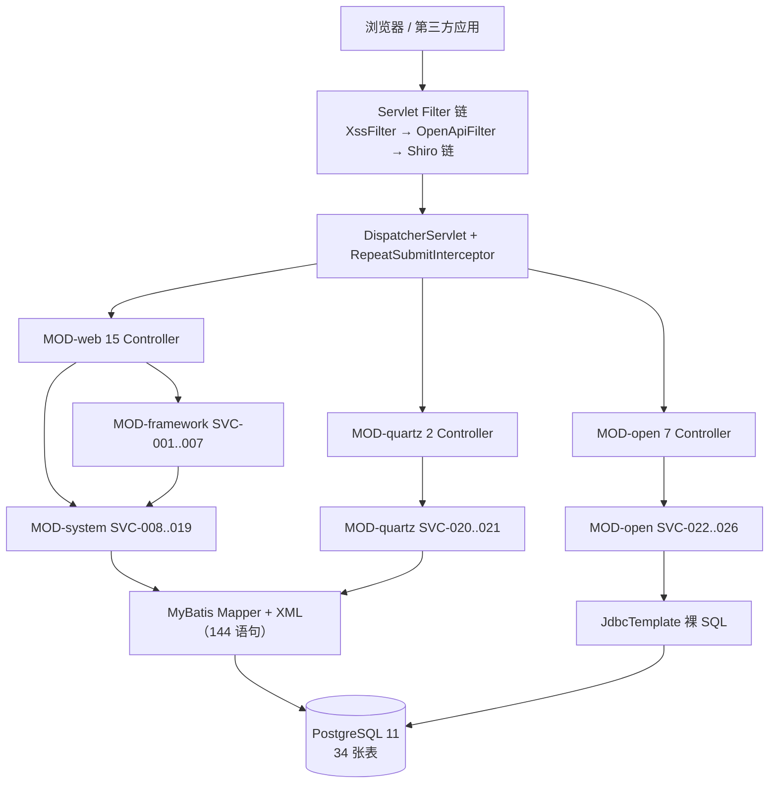

# SYS-qvsu-openapi 架构图文档

本文件是 `SYS-qvsu-openapi`（QVSU OpenAPI 管理与网关服务，版本 `1.0.0`）的**架构图文档**：图为主角，文字为图注与来源标注。

- 归属系统: `SYS-qvsu-openapi`（稳定 ID 主定义在 [`meta-model/technical-architecture.md`](./meta-model/technical-architecture.md)）
- 文档语言: 中文（zh-CN）。稳定 ID（`SYS-*`/`MOD-*`/`SVC-*`/`DOM-*`/`CAP-*`/`TBL-*`/`CFG-*`）、类名、包路径、URL、表名/字段名、配置键一律保持源码原文
- 证据等级口径（沿用元模型定义）: `事实` = 直接读源码/配置/DDL；`推断` = 由多处证据交叉推出；`假设` = 缺少直接证据、需运行或人工确认
- 上游输入: `docs/meta-model/` 下 25 份中文元模型文档（官方校验器 `PASS` / `ERROR=0`，见 [`meta-model/consistency-report.md`](./meta-model/consistency-report.md)）
- 本文件**不定义任何新的稳定 ID**，只引用元模型既有 ID 与物理名，避免与元模型的主定义归属规则冲突
- 本文件的图以 **ASCII 框图为主**（本仓库无 Mermaid 渲染环境），另在分层架构与模块依赖两处附 Mermaid 作为机器可读补充

**阅读提示**：本文件在正文中对元模型内部不一致之处做了显式标注（见 [第 11 章](#11-材料冲突与核验记录)），凡与元模型文档表述不一致的地方，均以**源码直读结果**为准并给出复核命令口径。

---

## 1. 系统定位与上下文图

### 1.1 系统边界（事实）

`SYS-qvsu-openapi` 是**单体（非微服务）Spring Boot 应用**，在同一进程内同时承担两种角色，这是理解全部后续架构图的前提：

| 角色 | 入口 | 认证方式 | 主要消费者 |
|---|---|---|---|
| 后台管理平台 | `/login`、`/system/**`、`/monitor/**`、`/admin/open/**` | Shiro 会话（`ShiroConfig` 过滤器链） | 平台管理员（浏览器） |
| OpenAPI 网关 | `/open/**` | 自实现 `appKey` + HmacSHA256 签名（**不走 Shiro 会话**） | 第三方接入应用（服务端 HTTP） |

系统同时对外暴露 `SVC-022`~`SVC-026` 五个 OpenAPI 域服务，其中 `SVC-023`（鉴权）、`SVC-024`（转发）、`SVC-025`（调用日志）构成运行面，`SVC-022`（管理数据）、`SVC-026`（文档生成）构成管理面。

来源: `meta-model/technical-architecture.md` §「SYS-qvsu-openapi - QVSU OpenAPI 管理与网关服务（精简版）」；`meta-model/module-index.md` §4.4。

### 1.2 上下文图（ASCII）

```text
+-----------------------------------------------------------------------------------+
|                             SYS-qvsu-openapi                                       |
|                 单体 Spring Boot 2.7.18 / jar 1.0.0 / port 5656                    |
|                                                                                    |
|   +----------------------------------+   +-------------------------------------+   |
|   |  后台管理平台（管理面）           |   |  OpenAPI 网关（运行面）              |   |
|   |  /login /index /system/**        |   |  /open/**                            |   |
|   |  /monitor/** /admin/open/**      |   |  SVC-023 鉴权 → SVC-024 转发         |   |
|   |  认证 = Shiro 会话               |   |  认证 = appKey + HmacSHA256 签名      |   |
|   +----------------------------------+   +-------------------------------------+   |
+-----------------------------------------------------------------------------------+
        ^                ^                          ^                    |
        |                |                          |                    |
        | 管理 HTTP      | 管理 HTTP                | 签名调用           | 转发（出站）
        |                |                          |                    v
+-------+------+  +------+-------+        +---------+--------+   +-------------------+
| 平台管理员    |  | 浏览器用户    |        | 第三方接入应用    |   | 被代理业务系统     |
| （sys_user）  |  | （只读/自注册）|        | （持 appKey /     |   | open_api.         |
|              |  |              |        |   appSecret）     |   | target_url 指向   |
+--------------+  +--------------+        +------------------+   +-------------------+

外部依赖（进程外）：
  +---------------------------+   +----------------------------+   +---------------------+
  | PostgreSQL 11             |   | https://httpbin.org/*      |   | Druid 监控台         |
  | jdbc:postgresql://        |   | （自测种子数据的          |   | /druid/*             |
  | localhost:5432/jd_openapi |   |   target_url；外呼回显）   |   | statViewServlet      |
  | 34 张物理表 / 865 字段    |   |                            |   | 账号 postgres/123456 |
  +---------------------------+   +----------------------------+   +---------------------+
              ^                                                                ^
              | 唯一持久化载体（MyBatis + JdbcTemplate 双轨）                   | 同进程内 Servlet
              +----------------------------------------------------------------+
```

**图注**

1. 本图回答「系统边界在哪里、谁在调用它、它依赖什么」：系统只有**一个进程、一个部署单元、一个数据库**，不存在独立网关进程或消息中间件（`meta-model/module-index.md` §5.3「运行期装配」，事实）。
2. 关键结论一：**两套认证体系共存于同一个 `SecurityManager` 进程内**。`/open/**` 在 Shiro 链上被显式配置为 `anon`（`ShiroConfig.java:333`），由 `OpenApiFilter` 自行鉴权；`/admin/open/**` 却走 Shiro 会话（`ShiroConfig.java:349` 的 `/**` 兜底段）。这是全系统最重要的架构分界线。
3. 关键结论二：`https://httpbin.org` 不是业务依赖，而是**自测种子数据把 `open_api.target_url` 指向的公网回显服务**（`open-api/sql/open_api_httpbin_min_seed.sql` 第 19-24 行），它使网关成为向第三方发请求的出网通道（`meta-model/technical-architecture.md` §「已发现的技术债与风险」第 15 条，事实）。
4. 关键结论三：Druid 监控台 `/druid/*` 在**同一进程内**作为常规 Servlet 暴露，账号 `postgres`/`123456`、`allow` 为空不限来源 IP（`application-druid.yml` 第 43-50 行），与主库账号同名（事实）。

---

## 2. 分层架构图

### 2.1 分层框图（ASCII）

```text
+-------------------------------------------------------------------------------------------+
| L6 表现层   浏览器 + Thymeleaf 144 模板 + jQuery 3.7.1 / Bootstrap 3.4.1 / bootstrap-table |
|             templates/include.html 定义 header(title)/footer 片段；cache=false（开发态）    |
+-------------------------------------------------------------------------------------------+
                                    | HTTP（表单 POST + jQuery Ajax）
                                    v
+-------------------------------------------------------------------------------------------+
| L5 入口层   Filter 链 → Spring MVC Interceptor → Controller（24 类 / 184 端点）             |
|                                                                                           |
|   ① XssFilter                    common/xss/XssFilter.java        order=HIGHEST_PRECEDENCE |
|      urlPatterns=/system/*,/tool/*  ← 不覆盖 /open/** 与 /admin/open/**                    |
|   ② OpenApiFilter                open/filter/OpenApiFilter.java   仅 /open/ 前缀           |
|      @Component 自动注册，未显式 setOrder（与 ① 的相对顺序未声明）                          |
|   ③ Shiro 过滤器链               framework/config/ShiroConfig.java:304-349（20 条规则）    |
|      /login → anon,captchaValidate     /open/** → anon    /** → 6 段兜底链                |
|   ④ RepeatSubmitInterceptor       framework/interceptor/RepeatSubmitInterceptor +         |
|                                  impl/SameUrlDataInterceptor  addPathPatterns("/**")       |
|   ⑤ DispatcherServlet（内嵌 Tomcat 9.0.112）→ @RequestMapping 路由分发                     |
|   ⑥ GlobalExceptionHandler        framework/web/exception/GlobalExceptionHandler          |
|                                  @RestControllerAdvice，8 个 @ExceptionHandler             |
+-------------------------------------------------------------------------------------------+
        |                               |                              |
        | com.qvsu.web.controller.*     | com.qvsu.open.controller.*   | com.qvsu.quartz.controller.*
        v                               v                              v
+-------------------------------------------------------------------------------------------+
| L4 控制层   24 个 Spring MVC Controller 类                                                  |
|   MOD-web 15 个: CommonController(1) + web/controller/system 14 个（登录/验证码/注册/首页/  |
|                 个人中心 + 用户/角色/菜单/部门/岗位/字典/参数/公告）                        |
|   MOD-open 7 个: OpenAppController / OpenApiMgrController / OpenAuthController /           |
|                 OpenLogController / OpenDocController / OpenGatewayController /            |
|                 OpenSelftestHttpbinController                                              |
|   MOD-quartz 2 个: SysJobController / SysJobLogController                                  |
|   基类: 21/24 继承 common/core/controller/BaseController（3 个例外：CommonController、      |
|         OpenGatewayController、OpenSelftestHttpbinController）                              |
+-------------------------------------------------------------------------------------------+
                                    | 接口调用（SVC-*）
                                    v
+-------------------------------------------------------------------------------------------+
| L3 业务层   Service 接口 + ServiceImpl（26 个 SVC-* 服务）                                   |
|   MOD-framework 7 个: ConfigService / DictService / PermissionService（模板专用）           |
|                       SysLoginService / SysPasswordService / SysRegisterService /           |
|                       SysShiroService（SVC-001 ~ SVC-007）                                  |
|   MOD-system 12 个:  ISysUserService / ISysRoleService / ISysMenuService / ISysDeptService / |
|                       ISysPostService / ISysDictTypeService / ISysDictDataService /          |
|                       ISysConfigService / ISysNoticeService / ISysOperLogService /           |
|                       ISysLogininforService / ISysUserOnlineService（SVC-008 ~ SVC-019）     |
|   MOD-quartz 2 个:    ISysJobService / ISysJobLogService（SVC-020 ~ SVC-021）                |
|   MOD-open 5 个:      OpenManageService / OpenApiSecurityService / OpenApiProxyService /     |
|                       OpenApiLogService / ApiDocService（SVC-022 ~ SVC-026）                 |
+-------------------------------------------------------------------------------------------+
              |                                          |
              | 管理侧：MyBatis                            | 网关侧：JdbcTemplate 裸 SQL
              v                                          v
+-------------------------------------------------------------------------------------------+
| L2 数据访问层                                                                               |
|   轨道 A（MyBatis）: @MapperScan("com.qvsu.**.mapper")，SqlSessionFactory 由                 |
|     framework/config/MyBatisConfig.java 手工构建；Mapper 接口 18 个 + XML 18 个              |
|     （mapper/system/*.xml 16 个 + mapper/quartz/*.xml 2 个），共 144 条 SQL 语句             |
|     mapperLocations=classpath*:mapper/**/*Mapper.xml；PageHelper 1.4.7 方言 postgresql       |
|   轨道 B（JdbcTemplate）: OpenApiSecurityService（鉴权 SELECT）、                             |
|     OpenApiLogService（open_call_log INSERT）、OpenManageService（open_* 五表全量 CRUD）      |
|     —— MOD-open 无 Mapper 接口、无 Mapper XML（事实）                                        |
+-------------------------------------------------------------------------------------------+
                                    |
                                    v
+-------------------------------------------------------------------------------------------+
| L1 存储层   PostgreSQL 11（驱动 org.postgresql:postgresql:42.7.5）                          |
|   连接串 jdbc:postgresql://localhost:5432/jd_openapi?currentSchema=public&stringtype=...    |
|   34 张唯一物理表 / 865 字段：open_* 5 + sys_*/gen_* 18 + QRTZ_* 11                          |
|   物理外键 0 个；唯一约束 3 类（sys_dict_type.dict_type、open_app.app_key、open_api.api_path）|
+-------------------------------------------------------------------------------------------+
```

### 2.2 Mermaid 补充（分层与构件映射）



**图注**

1. 本图回答「一次请求穿过哪些层、每层由哪些实际类承载」：入口层有**四道彼此独立、顺序未完全声明**的关卡（XssFilter、OpenApiFilter、Shiro 链、RepeatSubmitInterceptor），任何一处调整都会改变全站行为（`meta-model/change-hotspots.md` §「HOT-SHIRO-CHAIN」，事实）。
2. 关键结论一：**数据访问是双轨制**。管理侧走 MyBatis（144 条语句），网关侧走 `JdbcTemplate` 裸 SQL；因此网关侧的表结构变更**不会**在 Mapper XML 中体现，是后续维护的主要耦合点（`meta-model/technical-architecture.md` §「架构结论汇总」，事实）。
3. 关键结论二：`MOD-open` 的控制器**不继承 `BaseController`**，也**不声明任何 `@RequiresPermissions`**（源码直读：`com/qvsu/open/controller/*.java` 中 `RequiresPermissions` 命中 0），其权限边界仅为 Shiro `/**` 段的登录校验（事实）。
4. 关键结论三：`/open/**` 的请求**不进入** `XssFilter`（`xss.urlPatterns=/system/*,/tool/*`），且 `OpenApiFilter` 用 `CachedBodyHttpServletRequest` 缓存原始请求体供签名与转发各读一次——XSS 过滤范围与网关签名算法的耦合关系见第 9 章 `RISK-SEC` 条目（事实）。

---

## 3. 模块依赖图

### 3.1 依赖矩阵（事实，来源 `meta-model/module-index.md` §5.1）

下表数字为 `import com.qvsu.<目标模块>.*` 的出现次数，由 265 个 `.java` 文件逐文件解析得出。

| 源模块 | MOD-common | MOD-framework | MOD-system | MOD-quartz | MOD-open | MOD-web |
|---|---:|---:|---:|---:|---:|---:|
| MOD-common（113 类） | — | 0 | 0 | 0 | 0 | 0 |
| MOD-framework（46 类，含根包 2 个启动类） | 140 | 42（自引用） | 21 | 0 | 0 | 0 |
| MOD-system（50 类） | 103 | 0 | 66（自引用） | 0 | 0 | 0 |
| MOD-quartz（19 类） | 44 | 0 | 0 | 28（自引用） | 0 | 0 |
| MOD-open（22 类） | 30 | 0 | 0 | 0 | 32（自引用） | 0 |
| MOD-web（15 类） | 111 | 8 | 22 | 0 | 0 | 0 |

### 3.2 模块依赖方向图（ASCII）

```text
                           +-------------------------------------------------+
                           |  根包 com.qvsu（归入 MOD-framework，推断）        |
                           |  QvsuApplication  @SpringBootApplication          |
                           |    exclude = DataSourceAutoConfiguration          |
                           |  组件扫描根包 com.qvsu → 6 模块共享一个上下文      |
                           +-----------------------+-------------------------+
                                                   | 运行期装载（无编译期依赖）
                                                   v
   +--------------------------+        +-------------------------------------------+
   |  MOD-web  Web 入口层      |        |  MOD-framework  框架层                    |
   |  15 Controller           | 8      |  Shiro / Druid / MyBatis 装配 / 4 切面    |
   |  (web.controller.*)      |------->|  2 拦截器 / AsyncManager / 7 服务         |
   +------------+-------------+        +---------------------+---------------------+
                |                                            |
                | 22                                         | 21  ← 唯一反向依赖
                |                                            v
                |                     +-------------------------------------------+
                |                     |  MOD-system  系统管理域                    |
                |                     |  12 服务 + 12 Impl + 16 Mapper + 10 实体   |
                |                     +---------------------+---------------------+
                |                                            |
                | 111                                        | 103
                v                                            v
   +-------------------------------------------------------------------------------+
   |                        MOD-common  通用基座（113 类）                          |
   |  出向依赖 0 —— 注解 / 常量 / 基类 / AjaxResult / TableDataInfo / 枚举 / 异常 /  |
   |   工具类 / xss；并寄宿 6 个系统域核心实体（SysUser、SysRole、SysMenu、          |
   |   SysDept、SysDictType、SysDictData）—— 实体跨模块寄宿（事实，结构性问题）      |
   +-------------------------------------------------------------------------------+
                ^                                    ^
                | 44                                 | 30
   +------------+-------------+        +-------------+-------------------------------+
   |  MOD-quartz  调度域       |        |  MOD-open  OpenAPI 管理网关模块            |
   |  2 Controller + 2 服务    |        |  7 Controller + 5 服务 + 1 过滤器          |
   |  + 6 个 Quartz 工具类     |        |  无 Service 接口 / 无 Mapper / 无 XML      |
   |  + 2 任务 Bean            |        |  数据访问 100% 走 JdbcTemplate             |
   +--------------------------+        +-------------------------------------------+

   ---------- 无任何依赖关系的三条边（可独立演进） ----------
     MOD-system  <-- 0 -->  MOD-quartz
     MOD-system  <-- 0 -->  MOD-open
     MOD-quartz  <-- 0 -->  MOD-open
```

### 3.3 循环依赖检查结论

```text
   检查项                       结论            证据
   --------------------------   -------------   --------------------------------------
   包级循环依赖（A→B 且 B→A）    不存在          6 条 A→B 边均为单向；MOD-common 行全 0
   反向依赖（分层倒置）          存在 1 处       MOD-framework → MOD-system（21 处 import）
   跨层直连实现类                存在 1 处       AsyncFactory → SysLogininforServiceImpl
   领域实体跨模块寄宿            存在 1 处       6 个系统域实体位于 common/core/domain/entity
   控制器分布不一致              存在           system 控制器在 MOD-web；open/quartz 自带
   网关与安全框架解耦            已解耦          MOD-open → MOD-framework import = 0
```

**图注**

1. 本图回答「模块之间谁依赖谁、有没有环」：**不存在包级循环依赖**，但存在 **1 处分层倒置**——框架层（`MOD-framework`）反过来依赖业务域（`MOD-system`），共 21 处 import，集中在 `UserRealm`、`SysLoginService`、`SysShiroService`、`LogoutFilter`、`OnlineWebSessionManager`、`AsyncFactory`（`meta-model/module-index.md` §5.3，事实）。
2. 关键结论一：倒置是**运行期安全框架读取业务用户数据的必然结果**，不是编码失误；但在没有接口契约的情况下，它使 `MOD-system` 无法独立演进，也让"框架层不应知道业务实体"的分层规则失效。
3. 关键结论二：`MOD-open` 与 `MOD-framework` 的 import 数为 **0**，`ShiroConfig` 把 `/open/**` 显式设为 `anon`，`OpenApiFilter` 用 `shouldNotFilter` 限定只作用于 `/open/` 前缀——**网关是彻底自实现的旁路**，不共享 Shiro 会话、缓存或权限模型（`meta-model/module-index.md` §5.3「网关与安全框架解耦检查」，事实）。
4. 关键结论三：`MOD-open` 是**唯一没有 Service 接口、没有 Mapper、没有 Mapper XML 的模块**（全量 `JdbcTemplate`），与 `MOD-system`/`MOD-quartz` 形成两套数据访问范式（事实）。

---

## 4. 部署架构图

### 4.1 `deploy/local-docker` 部署框图（可复现路径，事实）

```text
 宿主机（Windows 开发机 / Linux 服务器）        D:/data/jd_openapi/postgres（默认数据目录）
        |                                                    ^
        |  docker compose up -d --build                      | bind mount
        v                                                    |
 +---------------------------------------------------------------------------+
 |  compose project: openapi-local                                           |
 |                                                                           |
 |  +-------------------------------------+   +----------------------------+ |
 |  | 容器 openapi-app                    |   | 容器 openapi-postgres11    | |
 |  | image: openapi-app:local            |   | image: postgres:11         | |
 |  | build:                              |   |  (docker.m.daocloud.io/    | |
 |  |   context: ../../                   |   |   library/postgres:11)     | |
 |  |   dockerfile: deploy/local-docker/  |   |                            | |
 |  |               Dockerfile            |   | POSTGRES_USER=postgres     | |
 |  |                                     |   | POSTGRES_PASSWORD=123456   | |
 |  | 端口: ${APP_PORT:-5656}:5656        |   | POSTGRES_DB=jd_openapi     | |
 |  | 容器内应用监听 5656                  |   | 端口: 5433:5432            | |
 |  | JAVA: eclipse-temurin:8-jre         |   | TZ=Asia/Shanghai           | |
 |  | jar: /app/qvsu-openapi.jar          |   | healthcheck: pg_isready    | |
 |  |                                     |   |   interval 10s / retries 20| |
 |  | 挂载（只读）:                        |   |   start_period 45s         | |
 |  |   ./conf/application-docker-        |   |                            | |
 |  |     local.yml                       |   | initdb 挂载（只读）:        | |
 |  |   → /opt/openapi/conf/              |   |   ./postgres/init →        | |
 |  |     application-docker-local.yml    |   |   /docker-entrypoint-      | |
 |  |                                     |   |     initdb.d               | |
 |  | 环境变量:                            |   |  00-init → 10-qvsu →       | |
 |  |   SPRING_CONFIG_ADDITIONAL_         |   |  30-open-api → 31-compat → | |
 |  |     LOCATION=file:/opt/openapi/     |   |  35-quartz → 40-menu →     | |
 |  |     conf/application-docker-local.yml|  |  50-seed                   | |
 |  |   TZ=Asia/Shanghai                  |   |                            | |
 |  | depends_on: postgres                |   |                            | |
 |  |   condition: service_healthy        |   |                            | |
 |  +------------------+------------------+   +-------------+--------------+ |
 |                     |                                    ^                  |
 |                     |  jdbc:postgresql://postgres:5432/  |                  |
 |                     +------------------------------------+                  |
 +---------------------------------------------------------------------------+
        |
        v
  http://localhost:5656/login    （默认账号 admin/admin123，来源 open-api/README.md）

 Dockerfile 多阶段构建（deploy/local-docker/Dockerfile，18 行）：
   stage 1  FROM maven:3.9.9-eclipse-temurin-8   COPY qvsu-openapi/pom.xml → mvn dependency:go-offline
                                                 COPY .  → mvn -DskipTests package
   stage 2  FROM eclipse-temurin:8-jre           COPY --from=builder /workspace/qvsu-openapi/target/
                                                 qvsu-openapi.jar /app/qvsu-openapi.jar
            ENTRYPOINT java -jar /app/qvsu-openapi.jar        ← 实际监听 5656
            EXPOSE 80                                          ← 与 5656 不一致（技术债 #6）
```

### 4.2 `deploy/dev-docker` 不可复现路径（事实，反例）

```text
 开发者本地已有 jar + 已推送镜像 才能走通；新环境仅凭仓库无法复现
      |
      |  docker compose -f deploy/dev-docker/docker-compose.yml up -d
      v
 +-----------------------------------------------------------------------+
 | 容器 qvsu-openapi                                                     |
 | image: registry.cn-shenzhen.aliyuncs.com/chaoqs/qvsu_open_api:        |
 |        qvsu_open_api_2026-03-27-13-12-27                              |
 |        ↑ 外部阿里云固定 tag，仓库内无构建产出（现象一）                 |
 | ports: 5656:5656                                                      |
 | volumes: ./logs:/app/logs、./data:/app/data                            |
 | compose 未声明 build: 段                                              |
 +-----------------------------------------------------------------------+
      ^
      |  deploy/dev-docker/Dockerfile（18 行）
      |    FROM registry.cn-shenzhen.aliyuncs.com/chaoqs/openjdk:8-jdk-alpine
      |    COPY open-api/qvsu-openapi/target/*.jar /app/qvsu-openapi.jar
      |         ↑ 需要「仓库上一级目录」作为构建上下文（现象二）
      |    EXPOSE 5656（与 local-docker 的 EXPOSE 80 不一致）
      |
      +--- 无 MySQL 服务对应：deploy/local-docker/mysql/init/ 下 7 个脚本
           完整存在（含 00-create-db.sql 建 utf8mb4 库），但
           docker-compose.yaml 只声明 postgres 服务、只挂载 ./postgres/init
           → MySQL 一套是死代码（技术债 #7）
```

**图注**

1. 本图回答「这套系统怎么起、起几份、配置从哪来」：**可复现路径只有 `deploy/local-docker` 一条**，`docker compose up -d --build` 即可得到应用 + PostgreSQL 11 全栈，健康检查用 `depends_on.condition: service_healthy` 保证初始化顺序（`meta-model/technical-architecture.md` §「部署形态」，事实）。
2. 关键结论一：**配置来源是三层的**——jar 内 `application.yml`（148 行，117 键）+ jar 内 `application-druid.yml`（62 行，29 键，`spring.profiles.active=druid` 激活）+ 容器挂载的 `application-docker-local.yml`（6 键，覆盖主库连接串为容器名 `postgres:5432`）。三者优先级为挂载覆盖 > profile > 主配置。
3. 关键结论二：`deploy/dev-docker` 是**仅供"已构建 jar + 已推送镜像"内存流程**的路径：镜像为外部阿里云固定 tag、`Dockerfile` 的 `COPY` 路径要求仓库上一级作为构建上下文而 compose 未声明 `build:`、`open-api/code-app-example` 目录不存在——三者叠加导致新环境无法复现（事实，技术债 #5）。
4. 关键结论三：`EXPOSE 80`（local-docker）与 `EXPOSE 5656`（dev-docker）**互相矛盾且都与 `server.port=5656` 不一致**；`EXPOSE` 仅是镜像元数据，当前 compose 显式映射端口故不致命，但会误导 `docker run -P`、K8s 端口推导与镜像扫描基线（事实，技术债 #6）。
5. 关键结论四：初始化脚本按**文件名前缀排序**执行（`00-` → `10-` → `30-` → `31-` → `35-` → `40-` → `50-`），重命名会静默改变执行顺序；其中 `40-open-api-menu.sql` 的 PostgreSQL 版中文菜单名乱码（`搴旂敤绠＄悊`），MySQL 版正常（事实，技术债 #2）。

---

## 5. 安全架构图

### 5.1 Shiro 过滤器链与注册（ASCII）

```text
                        HTTP 请求
                            |
                            v
   [Servlet Filter 层]  XssFilter(order=HIGHEST_PRECEDENCE, /system/*,/tool/*)
                        OpenApiFilter(@Component, 仅 /open/ 前缀, 未显式 setOrder)
                            |
                            v
   +---------------------------------------------------------------------------------+
   |  Shiro FilterChainDefinitionMap（LinkedHashMap，按插入顺序逐条匹配）              |
   |  ShiroConfig.java:304-349，共 20 条规则                                          |
   |                                                                                 |
   |  段 A  匿名段（静态资源 12 条 + 2 条验证码）                                      |
   |    /favicon.ico** /qvsu.png** /ruoyi.png** /html/** /css/** /docs/**             |
   |    /fonts/** /img/** /ajax/** /js/** /qvsu/** /ruoyi/**            → anon         |
   |    /captcha/captchaImage** /captcha/captchaCode**                  → anon         |
   |    + PermitAllUrlProperties 扫描 @Anonymous 结果（当前全库 0 处使用 → 恒为空）     |
   |                                                                                 |
   |  段 B  功能段                                                                    |
   |    /logout                                 → logout                              |
   |    /login                                  → anon,captchaValidate                |
   |    /register                               → anon,captchaValidate                |
   |    /open/**                                → anon   ← 网关自鉴权，Shiro 不介入     |
   |    /selftest/**                            → anon   ← 自检桩无认证               |
   |                                                                                 |
   |  段 C  兜底段（其余全部请求）                                                     |
   |    /**  →  user,kickout,onlineSession,syncOnlineSession,csrfValidateFilter       |
   +---------------------------------------------------------------------------------+
                            |
                            v
   +---------------------------------------------------------------------------------+
   |  6 段过滤器实例注册（ShiroConfig.java:338-346，filters LinkedHashMap）             |
   |                                                                                 |
   |  #  过滤器名             实现类                                          实际状态 |
   |  1  user                 org.apache.shiro.web.filter.authc.UserFilter     生效   |
   |  2  kickout              framework.shiro.web.filter.kickout.              失效   |
   |                            KickoutSessionFilter                          (见注)  |
   |  3  onlineSession        framework.shiro.web.filter.online.               生效   |
   |                            OnlineSessionFilter                                   |
   |  4  syncOnlineSession    framework.shiro.web.filter.sync.                 生效   |
   |                            SyncOnlineSessionFilter                               |
   |  5  csrfValidateFilter   framework.shiro.web.filter.csrf.                关闭   |
   |                            CsrfValidateFilter       setEnabled(false)            |
   |  6  logout               framework.shiro.web.filter.LogoutFilter          生效   |
   |                                                                                 |
   |  非 /** 段独占：captchaValidate → CaptchaValidateFilter（仅 /login、/register）  |
   +---------------------------------------------------------------------------------+
                            |
                            v
   +---------------------------------------------------------------------------------+
   |  认证与授权内核                                                                   |
   |    SecurityManager = DefaultWebSecurityManager                                    |
   |      注入 UserRealm + EhCacheManager + OnlineWebSessionManager                     |
   |    Realm: framework/shiro/realm/UserRealm                                          |
   |      doGetAuthenticationInfo → SysLoginService.login（SVC-004）                    |
   |      doGetAuthorizationInfo  → 管理员: admin 角色 + *:*:*                          |
   |                                 非管理员: ISysRoleService.selectRoleKeys（SVC-009） |
   |                                           + ISysMenuService.selectPermsByUserId    |
   |    Web层（Thymeleaf）：PermissionService（SVC-003）→ shiro: 标签                  |
   |    方法级：authorizationAttributeSourceAdvisor → @RequiresPermissions              |
   +---------------------------------------------------------------------------------+
                            |
                            v
   +---------------------------------------------------------------------------------+
   |  会话与持久化（会话真值在缓存，数据库是投影）                                       |
   |    OnlineWebSessionManager   globalSessionTimeout = 30 min（expireTime*60*1000）   |
   |                              SessionIdUrlRewritingEnabled = false                  |
   |                              SpringSessionValidationScheduler（validationInterval） |
   |    OnlineSessionDAO extends EnterpriseCacheSessionDAO                              |
   |      读: doReadSession → SysShiroService.getSession → sys_user_online（SVC-007）    |
   |      写: syncToDb（dbSyncPeriod=1 min 节流 + 属性变更）                            |
   |            → AsyncManager → AsyncFactory.syncSessionToDb（异步 UPSERT）            |
   |      删: doDelete → status = OnlineStatus.off_line → deleteSession                 |
   |    表: sys_user_online（PK sessionId）                                             |
   |    缓存: Ehcache shiro-activeSessionCache / sys-authCache（永不过期）               |
   +---------------------------------------------------------------------------------+
```

**图注**

1. 本图回答「一个请求要过几道安全关卡、每道关卡是否真的生效」：链是**6 段齐备**的，但**第 5 段 `csrfValidateFilter` 被 `setEnabled(csrfEnabled)` 关闭**（`ShiroConfig.java:285` + `application.yml:144` 的 `csrf.enabled: false`），第 2 段 `kickout` 因 `shiro.session.maxSession: -1` 永不触发（`meta-model/common-capability-index.md` §「安全风险与存疑项」R-11），**设计强度高于实际强度**（事实）。
2. 关键结论一：`/open/**` 与 `/selftest/**` 是 **anon 白名单中的业务路径**（`ShiroConfig.java:333-334`），前者的安全性完全依赖 `OpenApiFilter` 的四要素校验，后者（9 个自检端点，含 `/selftest/httpbin/timeout`）**完全无认证**且无环境判断（事实，`meta-model/common-capability-index.md` R-20）。
3. 关键结论二：`@Anonymous` 扩展机制存在但**全库 0 处使用**，`PermitAllUrlProperties` 的扫描结果恒为空——一个"看起来可扩展、实际从未启用"的白名单来源（`meta-model/change-hotspots.md` §「HOT-SHIRO-CHAIN」第 2 条，事实）。
4. 关键结论三：会话是**缓存与数据库的最终一致投影**，`OnlineSessionDAO.doReadSession` 直连 `sys_user_online` 读，`syncToDb` 最多滞后 `dbSyncPeriod = 1` 分钟异步落库且失败只打日志——会产生"DB 有行但缓存已过期"或"缓存有会话但 DB 无行"的双向不一致（`meta-model/database-relations.md` §8.4 第 4 步，事实）。

### 5.2 权限校验链路与覆盖缺口（ASCII）

```text
   浏览器请求 POST /system/user/edit
        |
        | ① 认证：Shiro 链第 1 段 user 过滤器 → 无有效会话则跳 /login
        v
   Controller 方法（SysUserController#editSave）
        |
        | ② 注解拦截：AuthorizationAttributeSourceAdvisor（ShiroConfig:447-454）
        |    @RequiresPermissions("system:user:edit")
        v
   Subject.isPermitted("system:user:edit")
        |
        | ③ 授权数据源：UserRealm.doGetAuthorizationInfo（首次触发后进缓存）
        |    管理员  → 角色 admin + 权限串 *:*:*
        |    非管理员 → selectRoleKeys(userId) + selectPermsByUserId(userId)
        |                └─ SQL: sys_menu ⨝ sys_role_menu ⨝ sys_user_role ⨝ sys_role
        |                       条件 visible='0' AND r.status='0'
        v
   Ehcache sys-authCache（ehcache-shiro.xml:46-54，eternal / timeToLiveSeconds=0）
        |
        | ④ 未通过 → AuthorizationException
        v
   GlobalExceptionHandler#handleAuthorizationException
        Ajax 请求 → AjaxResult.error(...)
        非 Ajax → error/unauth 视图（shiro.user.unauthorizedUrl=/unauth）

   ---------- 缓存失效链路（关键缺口） ----------
   SysRoleServiceImpl（角色菜单变更） ✗ 无调用
   SysMenuServiceImpl（菜单变更）     ✗ 无调用
   AuthorizationUtils（工具类已存在）  ✗ 全库 0 调用点
   UserRealm.clearCachedAuthorizationInfo / clearAllCachedAuthorizationInfo
                                      ✗ 仅类内定义，无外部调用
   ⇒ sys-authCache 永不过期 + 无主动失效 = 权限变更后已登录用户的权限视图不刷新
     （双向风险：越权持续有效 / 新授权不生效）— R-4

   ---------- 权限注解覆盖分布（源码直读计数） ----------
   +-----------------------------------------------------------+---------+----------+
   | 包 / 控制器组                                              | 端点规模 | 权限注解 |
   +-----------------------------------------------------------+---------+----------+
   | com.qvsu.web.controller.system（14 类）                    |   145   |   95 处  |
   | com.qvsu.quartz.controller（2 类）                         |    22   |   18 处  |
   | com.qvsu.open.controller 5 个管理类                        |    36   |    0 处  |
   |   OpenAppController(9) OpenApiMgrController(9)             |         |          |
   |   OpenAuthController(6) OpenDocController(7)               |         |          |
   |   OpenLogController(5)                                     |         |          |
   | com.qvsu.open.controller.OpenGatewayController（网关）      |     1   |    0 处  |
   | com.qvsu.open.controller.OpenSelftestHttpbinController     |     9   |    0 处  |
   | com.qvsu.web.controller.common.CommonController            |     5   |    0 处  |
   | com.qvsu.web.controller.system 其余登录/首页/个人中心类      |     39  |    0 处  |
   +-----------------------------------------------------------+---------+----------+
   | 全系统合计（源码 @*Mapping 计数）                           |   220   |  105 个  |
   | 元模型口径（docs/tools/semantics.json 归一后的端点总数）     |   184   |  105 个  |
   | 未带权限码端点（元模型口径 184-105）                        |    79   |          |
   +-----------------------------------------------------------+---------+----------+

   ---------- open:* 权限码的两端不一致（事实） ----------
   sys_menu 侧（open-api/sql/open_api_menu.sql:7-26，D 类 5 + F 类 11 = 16 个码）：
     open:app:view   open:app:list  open:app:add  open:app:edit  open:app:remove
     open:api:view   open:api:list  open:api:add  open:api:edit  open:api:remove
     open:auth:view  open:auth:save
     open:log:view   open:log:list
     open:doc:view   open:doc:generate
   代码侧（com/qvsu/open/controller/*.java）：0 处引用；模板侧 templates/open/**：0 处 shiro:hasPermission
   ⇒ 16 个权限码是"纯数据"，不产生任何强制效果 —— R-1 / Q-79-endpoints-without-permission
```

**图注**

1. 本图回答「权限从注解到数据的完整链路是什么、在哪一环断掉」：链路 ①→④ 完整可走通，断点在**缓存失效**（`sys-authCache` 永不过期且无任何主动失效调用）与**注解缺位**（`open:*` 16 个权限码零引用）两处。
2. 关键结论一：`/admin/open/**` 的 36 个管理端点仅受 `/**` 段的 `user` 过滤器保护——**任何已登录用户（含最低权限角色）可完整读写应用/接口/授权/调用日志/文档**，包括 `POST /admin/open/auth/save`（改授权）、`/admin/open/app/resetSecret`（重置密钥）、`/admin/open/log/exportCsv`（全量导出含请求体的日志）（`meta-model/change-hotspots.md` §「HOT-PERM-GAP」，事实）。这是全系统最高优先级的授权缺口。
3. 关键结论二：权限判定数据源是 `sys_menu.perms` 经四表 join（`SysMenuMapper.xml:32-72`），`F` 类按钮行的 `perms` **会进入权限集合但不参与菜单渲染**（`selectMenusByUserId` 额外要求 `menu_type in ('M','C')`）——因此"补注解"这一动作在数据侧已具备全部前置条件，无需新增权限码（事实）。
4. 关键结论三：会话与权限缓存都是**进程内状态**，多实例部署下 `sys-authCache` 不共享、`kickout` 计数不共享、`loginRecordCache` 不共享（`meta-model/change-hotspots.md` §「4.4 并发授权修改」，推断）。

### 5.3 XSS / CSRF / 传输层防护现状对照

```text
   防护项            配置键 / 类                            当前值 / 状态        实际覆盖面
   ---------------   -----------------------------------   -----------------   -------------------------
   XSS 参数过滤      xss.enabled=true                      开启                /system/*、/tool/*
                     xss.urlPatterns=/system/*,/tool/*                         ✗ 不含 /open/**、
                     xss.excludes=/system/notice/*                             /admin/open/**、/selftest/**、
                     XssHttpServletRequestWrapper                               /common/**、/monitor/**
                     （仅重写 getParameterValues）                             ✗ 不处理 application/json 请求体
   CSRF 校验         csrf.enabled=false                    关闭                全部 88 个 POST 端点无防护
                     csrf.whites=/druid                    过滤器已实现但禁用   前端从不发送 X-CSRF-Token
                     CsrfValidateFilter
   SQL 注入纵深       Druid wall.multi-statement-allow      放宽（允许）        削弱多语句防护
                       = true
   传输层安全头       无 CSP / X-Frame-Options / HSTS /      全部缺失           浏览器侧无纵深
                       X-Content-Type-Options 设置点
   Cookie 属性        SimpleCookie: domain/path/httpOnly/   无 SameSite         跨站请求可携带 Cookie
                       maxAge（未设 SameSite）
                      shiro.cookie.maxAge=30                = 30 天             与配置注释「秒」不符
                                                           （实现按天换算）
   RememberMe 密钥    shiro.cookie.cipherKey=（空）          每次启动随机生成     重启后旧 Cookie 全失效；
                                                           （AES 128）          多实例互不兼容
   口令算法           new Md5Hash(loginName+password+salt)  MD5 + 盐            无慢哈希（bcrypt/argon2）
                      SysPasswordService
   口令重试           user.password.maxRetryCount=5          5 次锁定 10 分钟    计数在 Ehcache，重启清零
   验证码             shiro.user.captchaEnabled=true         开启（math 型）      /captcha/captchaCode 受
                      shiro.user.captchaType=math                              qvsu.testing.exposeCaptchaCode
                      qvsu.testing.exposeCaptchaCode=false                     控制，置 true 即成旁路
   开发态开关         spring.devtools.restart.enabled=true   开启                 生产配置未关闭
                      qvsu.demoEnabled=true                  开启                 演示模式语义残留
                      spring.thymeleaf.cache=false           关闭缓存             生产建议 true
```

**图注**

1. 本图回答「除认证授权之外，还有哪些防护、实际生效到什么程度」：**四类防护中有两类实质失效**（CSRF 关闭、XSS 不覆盖网关路径）、**两类部分放宽**（Druid wall 多语句、Cookie 无 SameSite）、**四类传输层安全头全部缺失**。
2. 关键结论一：CSRF 呈现"有防护外观、无防护实效"——页面仍下发 `<meta name="csrf-token" th:content="${session.csrf_token}"/>`（`templates/include.html:8`），但过滤器 `setEnabled(false)`；**若将来简单地把 `csrf.enabled` 改为 `true`，因前端从不发送 `X-CSRF-Token`，全部 88 个 POST 端点会立即失效**（`meta-model/common-capability-index.md` R-2，事实 + 推断）。这使 CSRF 修复不能是单点开关动作。
3. 关键结论二：XSS 过滤范围与网关存在**语义耦合**：`OpenApiSecurityService.verifySignature` 基于**原始 JSON 顶层字段**计算签名，若把 `/open/**` 纳入 XSS 过滤导致请求体被转义，签名校验会立即失败（`meta-model/change-hotspots.md` §「HOT-SHIRO-CHAIN」变更建议第 4 条，推断）。
4. 关键结论三：`/system/notice/*` 被 XSS 显式排除，而公告正文是富文本（`sys_notice.notice_content` 在 PostgreSQL 侧为 `text`），属于**知情取舍**而非疏漏；但同一排除规则同时放行了该路径下的全部参数（事实）。

---

## 6. 数据架构图

### 6.1 五簇总图与主写方向（ASCII）

```text
 ======================= 存储层：PostgreSQL 11，34 张唯一物理表 =======================
   物理外键: 0 个（全量 21 个 .sql 文件检索 foreign key / references / constraint = 0 命中）
   唯一约束: sys_dict_type.dict_type、open_app.app_key、open_api.api_path、
             open_app_api(app_id, api_id)  —— 本库仅有的三类完整性约束

 +-----------------------------+     +-------------------------------------------+
 |  簇 1  系统权限簇（9 张）    |     |  簇 2  开放平台业务簇（5 张）              |
 |  TBL-sys_user               |     |  TBL-open_app                             |
 |  TBL-sys_role               |     |  TBL-open_api                             |
 |  TBL-sys_menu               |     |  TBL-open_app_api                         |
 |  TBL-sys_dept               |     |  TBL-open_call_log                        |
 |  TBL-sys_post               |     |  TBL-open_api_doc                         |
 |  TBL-sys_user_role ⟵ 4 张关联 |     |  主写: OpenManageService（JdbcTemplate）   |
 |  TBL-sys_role_menu          |     |        + OpenApiLogService（仅日志表）      |
 |  TBL-sys_role_dept          |     +-------------------------------------------+
 |  TBL-sys_user_post          |
 |  主写: SysUserServiceImpl   |     +-------------------------------------------+
 |        SysRoleServiceImpl   |     |  簇 3  字典参数簇（3 张）                  |
 |        SysMenuServiceImpl   |     |  TBL-sys_dict_type ⟶ TBL-sys_dict_data     |
 |        SysDeptServiceImpl   |     |  TBL-sys_config（孤立表，无表间关系）       |
 |        SysPostServiceImpl   |     |  主写: SysDictTypeServiceImpl              |
 +-----------------------------+     |        SysDictDataServiceImpl              |
                                     |        SysConfigServiceImpl                |
 +-----------------------------+     +-------------------------------------------+
 |  簇 4  审计与通知簇（4 张）  |
 |  TBL-sys_oper_log           |     +-------------------------------------------+
 |  TBL-sys_logininfor         |     |  簇 5  Quartz 调度簇（13 张）              |
 |  TBL-sys_user_online        |     |  TBL-sys_job ──(弱引用)──> TBL-sys_job_log |
 |  TBL-sys_notice             |     |  TBL-QRTZ_* 11 张                          |
 |  主写: LogAspect →           |     |  主写: SysJobServiceImpl（sys_job）        |
 |        AsyncFactory（异步）  |     |        AbstractQuartzJob（sys_job_log）    |
 |        AsyncFactory（会话）  |     |  ★ QRTZ_* 11 张：DDL 已建，运行期 0 访问   |
 +-----------------------------+     |    （RAMJobStore；ScheduleConfig 为空占位）|
                                     +-------------------------------------------+
 =====================================================================================
```

### 6.2 关键逻辑外键与读写方向（ASCII）

```text
   ------ 簇 1：系统权限簇（含 4 组 N:M 与 2 棵自关联树） ------

        +------------------+                 +------------------+
        |    sys_dept      |                 |    sys_user      |
        | PK dept_id       |                 | PK user_id       |
        |    parent_id ────┼─┐自关联树        | UK? 无（check-   |
        |    ancestors  ═══┼═┘物化路径        |   LoginNameUnique|
        |                  |  "0,100,101"    |   走 SELECT）     |
        +--------+---------+                 +--+------------+--+
                 ^                              |            |
                 | dept_id                      | user_id    | user_id
                 |                              v            v
        +--------+---------+        +-----------+--+    +----+-------------+
        |  sys_role_dept   |        | sys_user_role|    | sys_user_post    |
        | PK(role_id,      |        | PK(user_id,  |    | PK(user_id,      |
        |    dept_id)      |        |    role_id)  |    |    post_id)      |
        +--------+---------+        +------+-------+    +--------+---------+
                 ^                         ^                     ^
                 | role_id                 | role_id             | post_id
                 |                         |                     |
        +--------+---------+        +------+-------+    +--------+---------+
        |    sys_role      |        |    sys_role  |    |    sys_post      |
        | PK role_id       |        +--------------+    | PK post_id       |
        |    data_scope    |                            +------------------+
        +--------+---------+
                 | role_id
                 v
        +--------+---------+        +------------------+
        |  sys_role_menu   |        |    sys_menu      |
        | PK(role_id,      |───────>| PK menu_id       |
        |    menu_id)      | menu_id|    parent_id ────┼─┐自关联树
        +------------------+        |    perms         | │
                                    +------------------+ ┘

   ★ 唯一写侧缺陷（事实，database-relations.md 5.1 序号 4）：
     SysMenuMapper.xml:118  deleteMenuById 只删 menu_id 自身 与 一层 parent_id 子行，
     SysMenuServiceImpl.java:304 未级联删 sys_role_menu
     ⇒ 删除菜单后 sys_role_menu 留孤儿行；该孤儿行还会让同名菜单重建时被
       selectCountRoleMenuByMenuId（SysMenuServiceImpl.java:340）误判为"已分配"

   ------ 簇 2：开放平台业务簇（应用/接口/授权三角 + 日志与文档的弱引用） ------

     +------------------+                      +------------------+
     |    open_app      |                      |    open_api      |
     | PK s_id          |                      | PK s_id          |
     | UK app_key       |                      | UK api_path      |
     |    app_secret    |                      |    method        |
     |    status        |                      |    target_url    |
     |    expire_time   |                      |    timeout_ms    |
     +---+----------+---+                      |    need_sign     |
         |          |                          +---+----------+---+
         | app_id   |  ┌────────────────────┐      | api_id   |
         +----------+─>|   open_app_api     |<─────+----------+
                      | PK s_id            |
                      | UK(app_id, api_id) |    写入唯一入口：
                      +--------------------+    POST /admin/open/auth/save
                                                → saveAppAuth：先 D 后批 C
                                                  （on conflict ... do update，幂等）
                      ┌────────────────────┐
                      |  open_api_doc      |    app_id → open_app.s_id（可空）
                      | PK s_id            |    api_ids VARCHAR(500) 逗号串
                      |    api_ids  -. 非规范化  ── 内含多个 open_api.s_id
                      |    html_content    |    上限约 71 个 7 位 ID
                      +--------------------+    含 appSecret 参与计算的签名示例

     open_app.app_key  -. 弱引用（字符串，可空）  -.>  open_call_log.app_key
     open_api.api_path -. 弱引用（无 api_id 列）  -.>  open_call_log.api_path
                                                          |
                        +---------------------------------+------------------+
                        |              open_call_log                         |
                        | PK s_id / 22 列                                    |
                        |   trace_id (IDX)  app_key (IDX, NULL-able)         |
                        |   app_name（写入时快照，改名后与 open_app 脱钩）      |
                        |   api_path（无 IDX，靠字符串匹配）                  |
                        |   req_headers / resp_headers ← 任何 Java 代码都不写 |
                        |   13 列 INSERT：其余 9 列由 DDL 默认值填充          |
                        |   无 UPDATE 入口、无 DELETE 入口 → 只增不减         |
                        +---------------------------------------------------+
   读取方：/admin/open/log/list（分页）、/stats（今日统计）、/exportCsv（全量导出）

   ------ 簇 3 / 4 / 5 摘要 ------
   字典参数簇: sys_dict_type.dict_type (UK) --1:N--> sys_dict_data.dict_type
               （改类型名靠 UPDATE 级联改键，非 FK ON UPDATE CASCADE；
                 sys_dict_data.dict_type 无约束无索引）
               sys_config：无表间关系，config_key 只被应用代码消费
               （ConfigService.getKey / DictService.getType）
   审计通知簇: sys_oper_log —— oper_name / dept_name 为写入时快照文本，无 ID 列，不可 join
               sys_logininfor —— login_name 弱引用，失败分支可指向不存在的用户
               sys_user_online —— login_name 逻辑外键，全仓库无一条 join sys_user 的 SQL
               sys_notice —— 无引用列
   调度簇:     sys_job.job_name + job_group -. 快照弱引用 .-> sys_job_log（无 job_id 列）
               QRTZ_* 11 张：DDL 存在，运行期零访问（RAMJobStore）
```

**图注**

1. 本图回答「34 张表怎么分簇、靠什么关联、谁在写谁在读」：**0 个物理外键**，参照完整性 100% 由应用层承担；关联表用"复合主键 + 先删后批插"维护（`meta-model/database-relations.md` §1、§3、§5，事实）。
2. 关键结论一：**5 簇关系中有 3 类强逻辑关系、4 类弱引用/快照关系**。强关系（有关联表或有唯一键锚点）：`sys_user↔sys_role↔sys_menu↔sys_dept↔sys_post`、`open_app↔open_api`、`sys_dict_type→sys_dict_data`。弱关系：`open_call_log.app_key/api_path`（字符串）、`open_api_doc.api_ids`（逗号串）、`sys_job_log.job_name`（快照）、`sys_oper_log.oper_name/dept_name`（快照）。
3. 关键结论二：**唯一的写侧级联缺陷在 `sys_menu` 删除**——`deleteMenuById` 只删自身与一层子行，不清理 `sys_role_menu`，孤儿行还会污染"是否已分配"校验（事实）；其余 3 张关联表的删除由 Service 层 `@Transactional` 配对清理。
4. 关键结论三：`open_call_log` 是**只增不减的审计表**（无 UPDATE/DELETE 入口），`req_headers`/`resp_headers` 是彻底死列（全仓库仅命中 DDL 与一个 MySQL 专有升级脚本），鉴权失败行的 `app_key`/`app_name` 恒为 NULL，因此按 `app_key` 过滤会漏掉全部鉴权失败记录（事实，`meta-model/database-relations.md` §8.1 L1/L2/L4）。
5. 关键结论四：`sys_dept.ancestors` 是**由 `parent_id` 派生的物化路径**，且运行期有两条不同实现：`SysDeptMapper.xml:82` 用 `position(',' || #{deptId} || ',' in ',' || ancestors || ',') > 0`（PostgreSQL 可用），`DataScopeAspect.java:136` 用 `find_in_set(...)`（**MySQL 专有，PostgreSQL 直接报错**）。同一语义两种函数，是数据架构层最脆弱的一处（事实，见第 9 章 `RISK-CONS` 条目）。

---

## 7. 核心调用链时序图

### 7.1 `FLOW-OPEN-GATEWAY` — 第三方应用调用开放平台接口

```text
   第三方应用      OpenApiFilter     CachedBody   TraceContext  OpenApiSecurity    OpenGateway    OpenApiProxy   open_*      下游系统
   (持 appKey)     (/open/**)        请求包装       (ThreadLocal)   Service(SVC-023)  Controller     Service(SVC-024)  表        targetUrl
       |                 |                |              |               |               |               |            |            |
   01  |-- POST /open/x ->|                |              |               |               |               |            |            |
       |  X-App-Key       |                |              |               |               |               |            |            |
       |  X-Timestamp     |  shouldNotFilter: !startsWith("/open/") → false（拦截）      |               |            |            |
   02  |  X-Nonce         |-- 包装成 CachedBodyHttpServletRequest -------->|               |               |            |            |
       |  X-Sign          |                |              |               |               |               |            |            |
       |  [业务参数]      |                |              |               |               |               |            |            |
   03  |                 |-- traceId: X-Trace-Id 或 UUID → TraceContext.set + MDC.put ---->|               |            |            |
       |                 |<- 响应头 X-Trace-Id -------------------------------------------|               |            |            |
   04  |                 |-- authenticate(request, body) ----------------------->|          |               |            |            |
       |                 |                |              |      normalizePath（去尾斜杠）  |               |            |            |
       |                 |                |              |      loadApiInfo(apiPath, method) ---- SELECT --->| open_api   |            |
       |                 |                |              |        ├ 路径不存在 → 40004 api path not found     |            |            |
       |                 |                |              |        ├ status != 1 → 40004 api status disabled  |            |            |
       |                 |                |              |        └ 非 POST 未命中 → 回退查 method='POST'    |            |            |
   05  |                 |                |              |      need_sign == 0 ?                          |            |            |
       |                 |                |              |        └ YES → appName="anonymous" 直接放行 ★匿名通道 |        |            |
   06  |                 |                |              |      need_sign == 1:                           |            |            |
       |                 |                |              |        四要素非空 ? 否 → 40001 missing auth headers       |            |
       |                 |                |              |        |timestamp - now| <= 5 min ? 否 → 40002 timestamp expired
       |                 |                |              |      loadAppInfo(appKey) ---- SELECT --------->| open_app   |            |
       |                 |                |              |        status=1 AND (expire_time IS NULL OR expire_time > now())
       |                 |                |              |        查不到 → 40001 appKey invalid or disabled |            |            |
   07  |                 |                |              |      checkNonce(appKey, nonce, now)             |            |            |
       |                 |                |              |        NONCE_CACHE(ConcurrentHashMap, 5min) ★单机内存      |            |
       |                 |                |              |        重复 → 40005 nonce already used          |            |            |
   08  |                 |                |              |      hasPermission(appId, apiId) -- SELECT ---->| open_app_api|           |
       |                 |                |              |        count = 0 → 40004 api permission denied  |            |            |
   09  |                 |                |              |      verifySignature:                          |            |            |
       |                 |                |              |        业务参数（Query + JSON 顶层字段，剔除       |            |            |
       |                 |                |              |        appKey/timestamp/nonce/sign/appSecret）    |            |            |
       |                 |                |              |        按 key 升序 k=v&k=v + &appSecret=xxx       |            |            |
       |                 |                |              |        HmacSHA256 → hex（比较忽略大小写）          |            |            |
       |                 |                |              |        不等 → 40003 signature verify failed      |            |            |
   10  |                 |<-- OpenAuthContext(appKey, appName, apiPath, method, targetUrl, timeoutMs) ---|            |            |
       |                 |-- request.setAttribute(OPEN_AUTH_CONTEXT) + OPEN_TRACE_ID --------->|          |            |            |
   11  |                 |-- filterChain.doFilter --------------------------------------->| gateway("/open/**")  |            |
       |                 |                |              |      取 OPEN_AUTH_CONTEXT（缺失 → 40001 鉴权上下文丢失）|          |
   12  |                 |                |              |               |-- forward(context, request, body) ---------->|        |
       |                 |                |              |               |   SimpleClientHttpRequestFactory（每次新建）  |        |
       |                 |                |              |               |   connectTimeout = readTimeout = timeoutMs    |        |
       |                 |                |              |               |     （默认 5000ms）                           |        |
       |                 |                |              |               |   copyHeaders 剥离 host/content-length/       |        |
       |                 |                |              |               |     x-app-key/x-timestamp/x-nonce/x-sign      |        |
       |                 |                |              |               |   注入 X-Trace-Id；拼接原始 query string       |        |
   13  |                 |                |              |               |--------------------------------------------->|-- HTTP -->
       |                 |                |              |               |<---------------------------------------------|<-- 响应 --
       |                 |                |              |               |  超时 → 50002；连接失败/异常 → 50001          |        |
   14  |                 |                |              |               |-- 响应体 JSON.parse 成功则作结构化 data，    |        |
       |                 |                |              |               |   失败则作纯文本；统一包 OpenResult.ok(data)  |        |
       |<-- HTTP 200 {"code":0,"msg":..,"data":..}  恒为 200，并带 X-Trace-Id ---|               |            |            |
   15  |                 |                |              |               |               |               |            |            |
       |                 |-- finally: 无条件 OpenApiLogService.save(...) --------------------->| INSERT 13 列 -->| open_call_log
       |                 |   trace_id, app_key, app_name, api_path, method, req_body(截4000), |            |            |
       |                 |   resp_code, resp_body(截4000), cost_ms, status, error_msg(截4000),|            |            |
       |                 |   client_ip, call_time                                              |            |            |
       |                 |   status: 0=成功 / 1=鉴权失败 / 2=代理或系统异常                       |            |            |
       |                 |   写入异常被 catch 后仅打 error 日志，不阻断主链路 ★可观测性静默丢失     |            |            |
       |                 |-- TraceContext.clear()                                               |            |            |

   ★ 标注说明：★匿名通道 = need_sign=0 跳过全部身份校验（当前无数据触发，DDL 默认 1、种子全为 1）
               ★单机内存 = NONCE_CACHE 为 static ConcurrentHashMap，多实例/重启后不共享 → 退化为非幂等
```

**图注**

1. 本图回答「一个开放接口调用从进来到写日志，经过哪些判定、失败长什么样」：共 15 个可观测步骤，其中 4 次数据库读（`open_api`×2~3、`open_app`×1、`open_app_api`×1）与 1 次数据库写（`open_call_log`）全部走 `JdbcTemplate`，**无事务包裹**（`meta-model/flow-index.md` §「FLOW-OPEN-GATEWAY」，事实）。
2. 关键结论一：**响应码语义被统一压平**。鉴权失败与转发失败都返回 HTTP 200，业务错误码放在 body；`open_call_log.resp_code` 记录的是 `OPEN_RESPONSE_CODE` 请求属性而 `OpenGatewayController` 一律写 200，因此**无法从该列还原下游真实 HTTP 状态码**（推断，`meta-model/flow-index.md` §FLOW-OPEN-GATEWAY「成功分支」）。
3. 关键结论二：错误码契约共 7 个，可直接作为对外 SLA 依据：`40001` 认证头缺失/appKey 无效/鉴权上下文丢失、`40002` 时间戳超差或格式非法、`40003` 签名失败、`40004` 路径不存在/API 禁用/无授权、`40005` nonce 重复、`50001` 后端调用失败、`50002` 超时（事实）。
4. 关键结论三：幂等性**唯一**靠 `checkNonce` 的 `appKey:nonce` 一次性校验，其状态在 JVM 堆内；多实例部署或重启后不共享，会退化为非幂等，而 `open_call_log` 无唯一约束（`trace_id` 仅普通索引 `idx_trace_id`）（事实 + 推断）。

### 7.2 `FLOW-ADMIN-LOGIN` — 管理员登录

```text
   浏览器         CaptchaValidate    SysLogin      UserRealm    SysLoginService  SysPassword    Shiro Session   AsyncFactory     sys_* 表
                 Filter             Controller                 (SVC-004)        Service(SVC-005)  Manager/DAO
      |                |                |              |             |                |               |              |               |
  01  |-- GET /login ----------------->|              |             |                |               |              |               |
      |                |                | ModelMap: isRemembered=true（shiro.rememberMe.enabled）|              |               |
      |                |                |           isAllowRegister ← sys_config.sys.account.registerUser          |               |
      |<-- login 模板（含 <meta name="csrf-token"> ）  |             |                |               |              |               |
  02  |-- GET /captcha/captchaImage -->|              |             |                |               |              |               |
      |   （Shiro 链上 /captcha/** = anon）             |             |                |               |              |               |
      |<-- 算术验证码图片（kaptcha math）               |             |                |               |              |               |
  03  |-- POST /login (username, password, validateCode, rememberMe) ->|             |               |              |               |
      |   Shiro 链: /login = anon,captchaValidate      |             |                |               |              |               |
      |                |-- isAccessAllowed: captchaEnabled=true 且 POST → validateResponse          |              |               |
      |                |   取 Session 中 kaptcha 值并立即 removeAttribute（一次性）                    |              |               |
      |                |   忽略大小写比较 validateCode  |             |                |               |              |               |
      |                |   不通过 → 仅设 CURRENT_CAPTCHA=CAPTCHA_ERROR 且 return true（不阻断）        |              |               |
  04  |                |                | ajaxLogin → new UsernamePasswordToken(u,p,rememberMe)         |              |               |
      |                |                | subject.login(token) ------>|             |                |               |              |
  05  |                |                |              | doGetAuthenticationInfo → SysLoginService.login  |               |
      |                |                |              |             |-- ① 验证码错误 → 记失败日志 + CaptchaException |              |
      |                |                |              |             |-- ② 用户名/口令空 → UserNotExistsException     |              |
      |                |                |              |             |-- ③ 口令长度越界 → UserPasswordNotMatchException|             |
      |                |                |              |             |-- ④ IP 黑名单（sys_config.sys.login.blackIPList）|             |
      |                |                |              |             |     命中 → BlackListException                   |              |
      |                |                |              |             |-- ⑤ selectUserByLoginName ---- SELECT -------->| sys_user     |
      |                |                |              |             |     为空 → UserNotExistsException               |              |
      |                |                |              |             |     del_flag=2 → UserDeleteException            |              |
      |                |                |              |             |     status=1  → UserBlockedException            |              |
  06  |                |                |              |             |-- ⑥ passwordService.validate(user, password) ->|              |
      |                |                |              |             |     Ehcache loginRecordCache.incrementAndGet    |              |
      |                |                |              |             |     > maxRetryCount(5) → RetryLimitExceed       |              |
      |                |                |              |             |     new Md5Hash(loginName+password+salt) 比对   |              |
      |                |                |              |             |     不符 → UserPasswordNotMatchException + 计数 |              |
      |                |                |              |             |-- ⑦ 通过 → 记成功日志 + setRolePermission(user) |              |
      |                |                |              |             |          + recordLoginInfo(userId) ---------->| UPDATE sys_user
  07  |                |                |              | 异常映射：CaptchaException→AuthenticationException      |              |
      |                |                |              |   UserNotExists→UnknownAccount  UserPasswordNotMatch→IncorrectCredentials
      |                |                |              |   RetryLimitExceed→ExcessiveAttempts  UserBlocked/RoleBlocked→LockedAccount
  08  |                |                |              |-- 会话创建：OnlineWebSessionManager.createSession        |
      |                |                |              |   globalSessionTimeout=30min, URL 重写关闭               |
      |                |                |              |   OnlineSessionDAO.syncToDb（dbSyncPeriod=1min 节流）    |
      |                |                |              |        → AsyncManager.execute(AsyncFactory.syncSessionToDb) ->| UPSERT -->| sys_user_online
  09  |                |                |              |   SpringSessionValidationScheduler 定时扫描 last_access_time
  10  |                |                |              |   KickoutSessionFilter: maxSession=-1 → 直接放行 ★踢人永不触发
      |<-- AjaxResult.success() code=0 ---------------|             |                |               |              |               |
      |   （失败分支：捕获 AuthenticationException → error(e.getMessage()) ★异常消息直接回显前端）  |              |               |
  11  |-- GET /index ----------------->|  SysIndexController.index    |                |               |              |               |
      |                |                | clearPage() 后 menuService.selectMenusByUser(user) --> SELECT --> sys_menu ⨝
      |                |                |   sys_role_menu ⨝ sys_user_role ⨝ sys_role（menu_type in ('M','C')            |
      |                |                |   且 visible='0' 且 ro.status='0'）|               |              |               |
      |                |                | 读 sys_config: sys.index.sideTheme/skinName/footer/tagsView/menuStyle       |
      |                |                | 写 Session 属性 CSRF_TOKEN     |                |               |              |
      |                |                | 按 nav-style Cookie 渲染 index 或 index-topnav                              |
      |<-- 后台首页（含 /admin/open/* 菜单链接）-------+             |                |               |              |               |
  12  |                |                | 首次授权判定 → UserRealm.doGetAuthorizationInfo                          |
      |                |                |   管理员: admin 角色 + "*:*:*"；非管理员: selectRoleKeys + selectPermsByUserId
      |                |                |   → 写入 Ehcache sys-authCache（永不过期，★无主动失效）                   |

   异步审计（与主链路并行）：所有失败/成功分支 → AsyncFactory.recordLogininfor
      → User-Agent 解析 browser/os + AddressUtils 补 login_location（addressEnabled=false 时为空）
      → INSERT sys_logininfor(login_name, status, ipaddr, login_location, browser, os, msg, login_time)
      → 同时写名为 sys-user 的 logger
```

**图注**

1. 本图回答「登录一次到底做了什么、失败会以什么形式暴露」：链路含 **8 个业务校验分支 + 1 个验证码分支 + 2 个数据库写（`sys_user` 更新、`sys_logininfor` 异步插入）+ 1 个会话 UPSERT**，全程**无事务**（`meta-model/flow-index.md` §FLOW-ADMIN-LOGIN，事实）。
2. 关键结论一：**验证码校验失败不阻断请求**——`CaptchaValidateFilter.onAccessDenied` 只设置请求属性 `CURRENT_CAPTCHA` 并返回 `true`，把拒绝判定延后到 `SysLoginService` 第 ① 步；这是"过滤器负责取值、Service 负责拒绝"的分工，也意味着绕过 Service 的任何登录路径都不会校验验证码（事实）。
3. 关键结论二：**异常消息直接回显前端**。`SysLoginController.ajaxLogin` 捕获 `AuthenticationException` 后返回 `error(e.getMessage())`，会把"验证码错误""密码错误次数超限"等业务语义暴露给调用方（事实）；与 `GlobalExceptionHandler` 的 `e.getMessage()` 回显同源（`meta-model/common-capability-index.md` R-8）。
4. 关键结论三：会话的写是**异步 + 节流**的（`dbSyncPeriod=1` 分钟），失败只打日志；`kickout` 因 `maxSession=-1` 永不触发；`loginRecordCache` 在 Ehcache 中，**进程重启即清零**，多实例下不共享（事实 + 推断，`meta-model/flow-index.md` §FLOW-ADMIN-LOGIN「幂等与事务边界」）。

### 7.3 `FLOW-QUARTZ-JOB` — 定时任务调度

```text
   启动阶段           SysJobServiceImpl      Quartz Scheduler       ScheduleUtils     AbstractQuartzJob    JobInvokeUtil      sys_* 表
   / 管理员           (SVC-020)              (RAMJobStore)                            (SVC-021)
      |                     |                       |                    |                 |                  |                |
  01  |  应用启动 @PostConstruct init()             |                    |                 |                  |                |
      |-------------------->|-- selectJobAll -----------------> SELECT sys_job（全表）                       |                |
      |                     |-- scheduler.clear()  ★启动先清空调度器    |                 |                  |                |
      |                     |-- 遍历逐条 createScheduleJob --------------------------------->|                  |                |
      |                     |                       |<-- getQuartzJobClass(isConcurrent) ---|                  |                |
      |                     |                       |     ├ QuartzJobExecution（允许并发）  |                  |                |
      |                     |                       |     └ QuartzDisallowConcurrentExecution（@DisallowConcurrentExecution）
      |                     |                       |<-- CronScheduleBuilder.cronSchedule(job.cronExpression)     |                |
      |                     |                       |<-- CronUtils.getNextExecution 为空 → scheduler.pauseJob     |                |
      |                     |   TaskException 仅记日志，不中断启动        |                 |                  |                |

   运行阶段（Cron 触发）
  02  Quartz 线程 ------------->|                       |-- Trigger 到期 → Job.execute(context) -->|               |
      |                     |                       |   context.getMergedJobDataMap()             |               |
      |                     |                       |     .get(ScheduleConstants.TASK_PROPERTIES) |               |
      |                     |                       |<-- before(): 开始时间写入 ThreadLocal ------|               |
      |                     |                       |<-- doExecute(sysJob) ---------------------->|               |
  03  |                     |                       |              |     jobType == JOB_TYPE_HTTP ?  |               |
      |                     |                       |              |       YES → invokeHttp:          |               |
      |                     |                       |              |         SpringUtils.getBean(RestTemplate.class)
      |                     |                       |              |         requestHeaders 按 JSON 解析              |
      |                     |                       |              |         requestBody / contentType(默认 application/json)
      |                     |                       |              |       NO  → invokeBean:          |               |
      |                     |                       |              |         解析 invokeTarget（如 qvsuTask.qvsuNoParams）
      |                     |                       |              |         isValidClassName: 点号数量 > 1 判为全类名  |
      |                     |                       |              |         → Class.forName(..).getDeclaredConstructor()
      |                     |                       |              |             .newInstance()  ★任意类反射实例化      |
  04  |                     |                       |<-- after(context, sysJob, null | e) ---------|               |
      |                     |                       |   构造 SysJobLog:                |               |               |
      |                     |                       |     jobName / jobGroup（无 job_id，快照）        |               |
      |                     |                       |     invokeTarget（HTTP 任务改写为 "METHOD url"）  |               |
      |                     |                       |     jobMessage = "<jobName> 总共耗时：<runMs>毫秒" ★耗时只在文本里
      |                     |                       |     status = SUCCESS / FAIL；exceptionInfo 截 2000
      |                     |                       |-- SpringUtils.getBean(ISysJobLogService).addJobLog -->| INSERT -->| sys_job_log
      |                     |                       |   写日志失败仅打日志，不影响任务本身                |               |
  05  |  CPU/时长边界：doExecute 抛出的异常被 execute 捕获，不再向上传播      |                 |               |

   管理阶段（后台 /monitor/job，带 @RequiresPermissions("monitor:job:*")）
  06  |-- POST /monitor/job/run ------->|-- scheduler.triggerJob（立即执行一次，不等 Cron）           |
      |-- POST /monitor/job/changeStatus ->|-- pauseJob / resumeJob + UPDATE sys_job.status          |
      |-- POST /monitor/job/remove ---->|-- scheduler.deleteJob 后 DELETE sys_job                   |
      |-- POST /monitor/job/add|edit -->|-- CronUtils.isValid 校验 → createScheduleJob / 重建 Trigger
      |   ★ pauseJob/resumeJob/changeStatus/deleteJobByIds/run/addJob/updateJob/updateSchedulerJob 均
      |     @Transactional(rollbackFor = Exception.class)，但 Scheduler 状态与 DB 事务不在同一事务域

   跨模块间接后果（与网关共享受限资源）
  07  JobInvokeUtil.invokeHttp 使用 SpringUtils.getBean(RestTemplate.class)（ResourcesConfig.restTemplate()）
      而 OpenApiProxyService 每请求 new RestTemplate(...) —— 两条出站 HTTP 路径，两条线程/连接策略
```

**图注**

1. 本图回答「定时任务怎么定义、怎么执行、日志怎么留」：调度器为 **RAMJobStore 内存模式**（`ScheduleConfig` 是 14 行空占位类，类注释明确"当前使用 Spring Boot 自动配置的 Scheduler（内存模式）"），任务定义的权威数据源是 `sys_job`，启动时 `scheduler.clear()` 后全量重建（`meta-model/technical-architecture.md` §「Quartz 调度」、`meta-model/database-relations.md` §5.5「Quartz 簇关键事实」，事实）。
2. 关键结论一：**`QRTZ_*` 11 张表是"DDL 上成立、运行期不生效"的休眠关系**——全量检索 `main` 目录下 `QRTZ`/`qrtz` 0 命中，Quartz 不使用 JDBC JobStore，这 11 张表既不写也不读（事实，`meta-model/common-capability-index.md` R-12）。
3. 关键结论二：**反射面是开放的**。`invokeTarget` 允许"全限定类名 + 方法名"任意反射实例化并调用，`isValidClassName` 只判断点号数量；`ScheduleUtils.whiteList` 存在但**未启用**——只要能把记录写进 `sys_job` 即可触发任意类加载（`meta-model/change-hotspots.md` §「HOT-QUARTZ-JOB」、`meta-model/flow-index.md` §FLOW-QUARTZ-JOB「失败分支」，事实）。
4. 关键结论三：**执行耗时只能从中文文本解析**。`SysJobLog.startTime`/`endTime` 在领域类中声明但 `sys_job_log` 只有 8 列，两字段不落库；耗时被编码进 `job_message` 的 `"<jobName> 总共耗时：<runMs>毫秒"`（`meta-model/database-relations.md` §7 N8，事实）。
5. 关键结论四：`sys_job_log` 的读取页面 `/monitor/jobLog` **无对应菜单记录**（全量检索 `open-api/**/*.sql` 的 `monitor:jobLog` 与 `/monitor/jobLog` 均 0 命中），属"有 Controller、无菜单"的不可达功能（事实，`meta-model/database-relations.md` §8.5）。

---

## 8. 开放平台业务架构图

### 8.1 应用 / 接口 / 授权三角（ASCII）

```text
 ============================ 管理面：管理员在后台建立接入关系 ============================
                                    平台管理员（浏览器）
                                            |
        +-----------------------------------+-----------------------------------+
        |                                   |                                   |
        v                                   v                                   v
 +---------------------+          +---------------------+          +---------------------+
 | MENU-open-app 2101  |          | MENU-open-api 2102  |          | MENU-open-auth 2103 |
 | 应用管理             |          | 接口管理             |          | 授权管理             |
 | /admin/open/app     |          | /admin/open/api     |          | /admin/open/auth    |
 | open:app:view       |          | open:api:view       |          | open:auth:view      |
 | OpenAppController   |          | OpenApiMgrController|          | OpenAuthController  |
 |  9 端点 / 0 权限注解 |          |  9 端点 / 0 权限注解 |          |  6 端点 / 0 权限注解 |
 +----------+----------+          +----------+----------+          +----------+----------+
            |                                |                                |
            | insertApp / updateApp          | insertApi / updateApi          | saveAppAuth
            | deleteAppByIds                 | deleteApiByIds                 | （先 D 后批 C，
            | resetSecret（genAppKey/Secret） | selectApiByPath(path, method)  |   on conflict do update）
            v                                v                                v
 +---------------------------------------------------------------------------------------+
 |                        OpenManageService（SVC-022，@Service，注入 JdbcTemplate）         |
 |  —— OpenAPI 管理面唯一数据服务，覆盖 5 张 open_* 表的全部读写 ——                          |
 +---------------------------------------------------------------------------------------+
            |                                |                                |
            v                                v                                v
 +---------------------+          +---------------------+          +---------------------+
 |     open_app        |          |     open_api        |          |    open_app_api     |
 |  PK s_id            |          |  PK s_id            |          |  PK s_id            |
 |  UK app_key         |<-------->|  UK api_path        |<-------->|  UK(app_id, api_id) |
 |     app_secret      |  app_id  |     method          |  api_id  |  create_time        |
 |     status          |          |     target_url      |          |  update_time        |
 |     expire_time     |          |     timeout_ms      |          +---------------------+
 |  14 列              |          |     need_sign       |           9 列
 +---------------------+          |  17 列              |           ↑
            |                     +---------------------+           |
            | app_id                          | s_id               | 授权关系的
            v                                 v                    | 唯一写入入口
 +---------------------+          +---------------------+          |
 |   open_api_doc      |          |   open_call_log     |          |
 |  PK s_id            |          |  PK s_id / 22 列    |          |
 |     app_id (可空)    |          |  trace_id (IDX)     |          |
 |     api_ids 逗号串   |          |  app_key  (IDX,可空)|          |
 |     html_content    |          |  app_name  快照     |          |
 |  12 列              |          |  api_path  弱引用   |          |
 +---------------------+          +---------------------+          |
   文档快照：含 appSecret 参与计算的 curl 签名示例        ↑          |
                                                        |          |
 ============================ 运行面：第三方调用 =========|==========|====================
                                                        |          |
   第三方应用 --(X-App-Key / X-Timestamp / X-Nonce / X-Sign)--> /open/** 
                 │                                                  |
                 │  OpenApiFilter ── OpenApiSecurityService（SVC-023）
                 │      ├ 读 open_api（api_path + method + status=1）─────┘（鉴权读，非写）
                 │      ├ 读 open_app（app_key + status=1 + 未过期）
                 │      ├ 读 open_app_api（app_id + api_id 授权计数）
                 │      └ 产出 OpenAuthContext ──> OpenGatewayController ──> OpenApiProxyService
                 │                                                              |
                 └──────────────────────────────────────────────────────────────┴──> target_url
                                                                                    （被代理系统）
   调用留痕：OpenApiFilter.finally → OpenApiLogService（SVC-025）→ INSERT open_call_log
```

### 8.2 「三角关系 + 日志 + 文档」的能力映射

```text
   +---------------------------+------------------------------------------+----------------------+
   | 业务能力（CAP-*）           | 实现落点                                  | 对应表 / 入口         |
   +---------------------------+------------------------------------------+----------------------+
   | CAP-open-app              | OpenAppController + OpenManageService     | open_app             |
   |   应用管理能力              | （含 appKey/appSecret 生成与重置密钥）      | /admin/open/app      |
   | CAP-open-api              | OpenApiMgrController + OpenManageService  | open_api             |
   |   接口管理能力              | （含按 path+method 查询、cURL 生成）        | /admin/open/api      |
   | CAP-open-auth             | OpenAuthController + OpenManageService    | open_app_api         |
   |   授权管理能力              | （覆盖式保存，幂等 upsert）                 | /admin/open/auth     |
   | CAP-open-log              | OpenLogController + OpenManageService     | open_call_log        |
   |   调用日志能力              | （列表/今日统计/Top5/CSV 全量导出）         | /admin/open/log      |
   | CAP-open-doc              | OpenDocController + ApiDocService(SVC-026) | open_api_doc         |
   |   文档管理能力              | （HTML 生成 + curl 示例 + 落库 + 下载）     | /admin/open/doc      |
   | CAP-open-gateway-auth     | OpenApiFilter + OpenApiSecurityService    | open_api/open_app/   |
   |   网关鉴权能力              | （四要素 + 时间漂移 + nonce + 授权 + 签名） | open_app_api         |
   | CAP-open-gateway-proxy    | OpenGatewayController + OpenApiProxyService| target_url（外部）    |
   |   网关代理转发能力          | （RestTemplate，接口级超时）                | /open/**             |
   +---------------------------+------------------------------------------+----------------------+
   | 无对应能力的缺口（不虚构）                                                            |
   |   ✗ 限流 / 配额（QPS、并发、日调用量、应用级配额 全部未实现；NONCE_CACHE>100000 只触发清理）|
   |   ✗ 审批流引擎（不存在；应用/接口/授权变更即生效，无审批节点）                          |
   |   ✗ 多租户（无租户维度）、✗ 消息推送（无短信/邮件/站内信）                              |
   +---------------------------------------------------------------------------------------+
```

**图注**

1. 本图回答「开放平台的业务对象是什么、它们如何组成闭环」：核心是**应用（`open_app`）↔ 接口（`open_api`）↔ 授权（`open_app_api`）三角**，授权关系是唯一的运行期准入依据（`OpenApiSecurityService.hasPermission` 用 `select count(1) from open_app_api where app_id=? and api_id=?` 判定），写入入口唯一为 `POST /admin/open/auth/save`（事实，`meta-model/database-relations.md` §5.2 序号 17-19）。
2. 关键结论一：**调用日志与文档是三角的"外围两翼"**，且都以弱引用挂接——`open_call_log.app_key`/`api_path` 是字符串弱引用（无 `api_id` 列），`open_api_doc.api_ids` 是 `VARCHAR(500)` 逗号串（上限约 71 个 7 位 ID，超长在 PostgreSQL 下报错、MySQL 非严格模式下静默截断）（`meta-model/database-relations.md` §5.2 序号 20-23、§7 N2/N3，事实）。
3. 关键结论二：**文档是 secret 的血缘下游**。`AppSecret` 的血缘不止鉴权链路，还包括 `open_api_doc.html_content` 与 `/admin/open/doc/download` 导出的 HTML 文件（`ApiDocService` 把 `X-Sign` 头值写入 curl 示例）（`meta-model/database-relations.md` §8.6，事实）。任何能访问文档管理页的已登录用户（当前无权限注解）都能从生成的 curl 示例中取得某应用的可用签名样例。
4. 关键结论三：**授权写入是"最后写入者胜出"**。`saveAppAuth` 先全删该应用授权再批量插入，`open_app_api` 无版本列、无冲突提示；`resetSecret` 无并发保护，两个管理员同时重置只有最后一次生效（`meta-model/change-hotspots.md` §「4.4 并发授权修改」，推断）。
5. 关键结论四：**三类常见平台能力在本系统不存在**：限流/配额、审批流引擎、多租户。业务架构文档中的场景标题「开放接口调用鉴权与**限流**」已显式标注"限流为假设且当前未实现"（`meta-model/business-architecture.md` §SCN-open-gateway-call「限流说明」，事实）。任何把这套系统作为"API 治理平台"评估的咨询结论，都必须把这三项计为**新增需求**而非既有能力。

---

## 9. 架构风险与改进方向

风险编号使用本文件自有的 `RISK-<类别>-<序号>` 标签（类别：`SEC` 安全 / `CONS` 一致性 / `OPS` 可运维性 / `EXT` 可扩展性），**不引入新的稳定 ID 前缀**。每条含：问题、证据、影响、建议方向、优先级。优先级口径：`P0` = 可被未授权或低权限主体直接利用 / 导致数据或凭据泄露；`P1` = 在正常运维路径下必然触发或影响面广；`P2` = 有明确代价但可计划性解决；`P3` = 工程卫生。

### 9.1 安全类（RISK-SEC）

| 编号 | 问题 | 证据（文件 + 行号 / 章节） | 影响 | 建议方向 | 优先级 |
|---|---|---|---|---|---|
| RISK-SEC-01 | 硬编码明文弱口令贯穿数据库与监控台：主库口令 `123456`、Druid 控制台 `postgres`/`123456`、容器 `POSTGRES_PASSWORD` 默认回退 `123456`、测试配置同值 | `application-druid.yml:11`（master.password）、`:49`（statViewServlet.login-username）、`:50`（login-password）；`deploy/local-docker/docker-compose.yaml:10`；`deploy/local-docker/conf/application-docker-local.yml:8`；`src/test/resources/application-druid.yml:9`；`meta-model/technical-architecture.md` §技术债 #8 | 数据库与 `/druid/*` 监控台可被暴力进入；监控台暴露全部 SQL 与连接信息；口令随代码入库，任何拿到仓库的人即拿到数据库凭据（事实） | ① 全量改为环境变量/密管注入，删除所有默认回退值；② 生产 `statViewServlet.enabled=false`，若保留则强制 `allow` 白名单 + 强口令 + 独立账号；③ 轮换现有口令；④ 增加启动期"弱口令检测"失败即拒绝启动的守卫 | **P0** |
| RISK-SEC-02 | `open:*` 16 个权限码零引用，`/admin/open/**` 的 36 个管理端点无 `@RequiresPermissions`，模板侧也无 `shiro:hasPermission` | 源码直读：`com/qvsu/open/controller/{OpenApp,OpenApiMgr,OpenAuth,OpenLog,OpenDoc}Controller.java` 中 `RequiresPermissions` 命中 0，`@*Mapping` 合计 36；权限码定义见 `open-api/sql/open_api_menu.sql:7-26`（5 个 `*:view` + 11 个按钮码）；`meta-model/common-capability-index.md` §安全风险 R-1；`meta-model/change-hotspots.md` §HOT-PERM-GAP；`meta-model/consistency-report.md` §4 的 `Q-79-endpoints-without-permission` | **任何已登录用户**（含最低权限角色）可直接：`POST /admin/open/auth/save` 改写任意应用授权、`/admin/open/app/resetSecret` 重置并取得密钥、`/admin/open/log/exportCsv` 全量导出含 `req_body`/`resp_body` 的调用日志、`/admin/open/doc/generate` 生成含签名示例的文档（事实） | ① 为 36 个端点补 `@RequiresPermissions`，复用已存在的 `open:*` 码（数据侧已就绪，无需新增权限码）；② 发布前用脚本校验"每个非 `anon` 写操作端点都有权限码"；③ 若决定不引入注解式授权，须在技术架构中显式声明"该模块仅以登录隔离为边界" | **P0** |
| RISK-SEC-03 | `need_sign=0` 构成匿名转发通道（潜在 SSRF）：该分支完全不校验 appKey、时间戳、nonce 与签名，直接以 `appName="anonymous"` 放行 | `OpenApiSecurityService.java:61-72`（匿名放行分支）；`open-api/sql/open_api.sql:35` `need_sign TINYINT DEFAULT 1`；种子数据 `open_api_selftest_seed.sql` / `open_api_httpbin_min_seed.sql` 全部为 `1`（当前无数据触发）；`meta-model/technical-architecture.md` §技术债 #14、#15 | `open_api` 是可通过 `/admin/open/api` 页面写入的业务表，任何具备 `open:api:edit` 权限（且当前该权限码不生效）的用户把 `need_sign` 置 0，即可把该路径变成无需凭据的转发入口；结合种子数据中已存在的 `http://127.0.0.1:80/...` 与 `http://10.255.255.1:81/...` 内网地址示范，可用于探测内网连通性（推断：可利用性取决于 `target_url` 的运维管控） | ① 移除 `need_sign=0` 分支或将其限定在白名单 `target_url` 前缀内；② 对 `target_url` 增加出站目标白名单（域名/IP 段）与协议白名单；③ 建立"内网地址禁止出站"的校验；④ 该变更必须与 RISK-SEC-02 同时做，否则匿名通道的开关仍在无权限保护的表单里 | **P0** |
| RISK-SEC-04 | CSRF 防护默认关闭，且前端从不注入 Token：`csrf.enabled=false`，Token 只下发不使用 | `application.yml:144`；`ShiroConfig.java:139-140`（`@Value("${csrf.enabled: false}")`）、`:285`（`setEnabled(csrfEnabled)`）；`templates/include.html:8`（下发 `<meta name="csrf-token">`）；全仓前端代码内 `X-CSRF-Token` 0 命中；`meta-model/common-capability-index.md` §安全风险 R-2 | 全部 88 个 POST 端点可被跨站构造请求；结合 Cookie `httpOnly=true` 但**无 SameSite 声明**（`ShiroConfig` 的 `SimpleCookie` 未设置），风险进一步放大；且"有防护外观、无防护实效"（事实） | ① 分两步落地：先给前端统一拦截器注入 `X-CSRF-Token`，再打开 `csrf.enabled`（单点开关会把全部表单打挂）；② Cookie 补 `SameSite=Lax/Strict`；③ 把 4 个 `*:view`/按钮码的修复与 CSRF 一起纳入同一发布批次 | **P0** |
| RISK-SEC-05 | XSS 过滤覆盖窄且不处理 JSON 请求体：`urlPatterns=/system/*,/tool/*` 不覆盖 `/open/**`、`/admin/open/**`、`/selftest/**`、`/common/**`、`/monitor/**`；包装器仅重写 `getParameterValues` | `application.yml:133-139`；`common/xss/XssFilter.java:62`；`common/xss/XssHttpServletRequestWrapper.java:23`；`framework/config/FilterConfig.java:36`；`meta-model/common-capability-index.md` §安全风险 R-3 | 网关会原样转发外部请求体，`open_call_log.req_body` 也原样落库并在日志页渲染/CSV 导出，构成存储型 XSS 与导出注入的载体（推断） | ① 扩展过滤范围并**先**保证不破坏 `/open/**` 的签名（`verifySignature` 基于原始 JSON 顶层字段，请求体被转义会直接导致 40003）；② 输出侧对 `open_call_log` 字段做转义（Thymeleaf 默认已转义，需核查 `th:utext` 使用点）；③ CSV 导出对 `=`/`+`/`-`/`@` 开头单元格加前缀转义（见 RISK-SEC-06） | **P1** |
| RISK-SEC-06 | CSV 导出存在公式注入：`open_call_log` 的 `req_body`/`resp_body` 来自外部请求，导出时只做双引号包裹与 `"`→`""` 转义、`\r`/`\n`→空格替换，**未对 `=`/`+`/`-`/`@` 开头单元格加前缀**；导出未分页（全量） | `OpenLogController.java:58-126`（`csv()` 实现与 `exportCsv` 未调 `startPage()`）；`meta-model/flow-index.md` §FLOW-CALLLOG-QUERY「成功分支与失败分支」 | 管理员打开导出文件时可能触发 Excel 公式执行（推断）；全量导出在日志量增长后会造成接口超时与内存压力 | ① 对以 `=`/`+`/`-`/`@`/`\t`/`\r` 开头的单元格前置 `'` 或空格；② 导出改为流式 + 时间窗上限 + 异步任务；③ 同时给 `/admin/open/log/exportCsv` 补权限码与 `@Log` 审计 | **P1** |
| RISK-SEC-07 | 授权缓存永久有效且无主动失效：`sys-authCache` 为 `eternal`/不过期，`clearCachedAuthorizationInfo`/`clearAllCachedAuthorizationInfo` 与 `AuthorizationUtils` 在全库**无调用点** | `resources/ehcache/ehcache-shiro.xml:46-54`；`framework/shiro/realm/UserRealm.java:138,147`；`framework/shiro/util/AuthorizationUtils.java`（工具类存在但 0 调用）；`meta-model/common-capability-index.md` §安全风险 R-4 | 角色/菜单变更后已登录用户的权限视图不刷新——**双向风险**：撤销的权限持续有效（越权），新授予的权限不生效（误判为故障） | ① 在 `SysRoleServiceImpl`/`SysMenuServiceImpl` 的授权相关 `@Transactional` 方法末尾调用 `AuthorizationUtils.clearAllCachedAuthorizationInfo()`；② 给出缓存 TTL 上限作为兜底；③ 为"改权限后立即生效"补一条集成测试 | **P1** |
| RISK-SEC-08 | 并发登录控制实际失效 + 验证码旁路开关 + 自检桩无认证：`maxSession=-1` 使 `kickout` 直接放行；`/captcha/captchaCode` 受 `qvsu.testing.exposeCaptchaCode` 控制；`/selftest/**` 9 个端点 `anon` 且无环境判断 | `application.yml:125`（`maxSession: -1`）、`:15-16`（`exposeCaptchaCode: false`）；`KickoutSessionFilter.java:64`；`SysCaptchaController.java:112-134`；`ShiroConfig.java:334`；`OpenSelftestHttpbinController.java`；`meta-model/common-capability-index.md` §安全风险 R-9、R-11、R-20 | 同一账号可无限并发登录（无法定位"谁在线"）；一旦 `exposeCaptchaCode=true` 验证码防护完全失效；`/selftest/httpbin/timeout` 可被用于占用线程（3 秒） | ① 依业务需要设置 `maxSession`；② CI 与生产 profile 强制 `exposeCaptchaCode=false` 并加启动断言；③ `/selftest/**` 按 profile 关闭或限制来源 IP | **P1** |
| RISK-SEC-09 | 传输层安全头与 Cookie 属性缺失：无 CSP / X-Frame-Options / HSTS / X-Content-Type-Options 设置点；`SimpleCookie` 无 SameSite；`shiro.cookie.maxAge=30` 被实现按**天**解释（30 天），与配置注释"秒"不符 | `meta-model/technical-architecture.md` §技术债 #16；`ShiroConfig.java:396`（`maxAge * 24 * 60 * 60`）；`application.yml:114` | 浏览器侧无纵深防护（点击劫持、混合内容、跨站携带 Cookie）；rememberMe 有效期比预期长 86400 倍（事实） | ① 增加安全头过滤器（或反向代理层统一注入）；② Cookie 补 `SameSite`；③ 修正 `maxAge` 单位语义并同步注释；④ 若需长时间保持登录，改用服务端会话而非延长 Cookie | **P1** |
| RISK-SEC-10 | `rememberMe` 密钥每次启动随机生成，且多实例互不兼容 | `ShiroConfig.java:403-416`（`cipherKey` 为空时 `CipherUtils.generateNewKey(128,"AES")`）；`application.yml:116`（`cipherKey:` 空）；`meta-model/common-capability-index.md` §安全风险 R-5 | 每次重启后全部已签发 rememberMe Cookie 解密失败（用户被动重新登录）；集群部署不可行 | ① 生产注入固定 `cipherKey`（Base64 AES 128）；② 密钥纳入密管并支持轮换窗口；③ 与 RISK-SEC-01 一并纳入"密钥外置"改造 | **P1** |
| RISK-SEC-11 | 内部信息回显与异常吞没：`GlobalExceptionHandler` 返回 `e.getMessage()`；`SysLoginController.ajaxLogin` 回显业务异常消息；多处 `HttpServletResponse` 直写且空 `catch` | `framework/web/exception/GlobalExceptionHandler.java:71,82`；`SysLoginController.java:66-74`；`CommonController.java:66-69,159-162`；`OpenLogController.java:112-115`；`OpenDocController.java:102-104`；`SysCaptchaController.java:88-90`；`meta-model/common-capability-index.md` §安全风险 R-8、R-14、R-15 | 可能泄露 SQL、路径、类名；用户侧表现为空白响应无提示（登录失败原因也被完整回显，便于账号枚举） | ① 建立"对外消息-内部日志"双轨：统一错误码 + 通用文案，内部信息只进日志；② 登录失败统一为同一文案；③ 空 `catch` 补错误响应体与日志 | **P2** |
| RISK-SEC-12 | 口令散列使用 MD5 + 盐，且 `Md5Utils.hash` 失败时静默返回明文 | `SysPasswordService.java:42-84`（`new Md5Hash(loginName + password + salt).toHex()`）；`common/utils/security/Md5Utils.java:61-65`（catch 分支 `return s`）；`meta-model/common-capability-index.md` §安全风险 R-6 | 口令可被高速离线爆破；极端情况下口令以明文参与比较/存储 | ① 迁移到 bcrypt/argon2 并支持登录时自动升级；② `Md5Utils.hash` 失败改为抛异常（绝不明文返回）；③ 该变更需与 RISK-SEC-01 的口令轮换同批发布 | **P2** |
| RISK-SEC-13 | 依赖与框架腐化：`fastjson 1.2.83`（已停止维护）、`poi 4.1.2`（2020 年版本）、`shiro 1.13.0` 与 Spring Boot 2.7.18 的组合未经绕过验证、前端 Bootstrap 3.4.1 已停止维护 | `pom.xml:72-100`（依赖清单）、`:36-70`（dependencyManagement）；`meta-model/technical-architecture.md` §技术债 #20；`meta-model/technical-component-index.md` §1 后端组件目录 | 历史反序列化高危版本线、已知 CVE 修复缺口、无安全补丁来源（推断/假设） | ① `fastjson` → `fastjson2` 或 Jackson（先做 JSON 调用点清点：签名串拼接、网关响应包装、操作日志参数序列化）；② `poi` 升级并回归 Excel 导入导出；③ 建立依赖漏洞扫描基线并纳入构建 | **P2** |
| RISK-SEC-14 | Druid `wall` 防护被放宽 + 监控台与 Druid 页面被当作常规路径：`multi-statement-allow=true`、`statViewServlet.enabled=true`、`url-pattern=/druid/*`、`csrf.whites=/druid`、`allow` 为空 | `application-druid.yml:41-50,59-60`；`application.yml:146`；`meta-model/technical-architecture.md` §技术债 #12 | 削弱 SQL 注入纵深防御；监控台构成独立风险面（与 RISK-SEC-01 叠加） | ① `multi-statement-allow=false`（需先确认无多语句调用点）；② 关闭或白名单化监控台；③ 移除 `csrf.whites=/druid` 或与 CSRF 修复统一处理 | **P2** |
| RISK-SEC-15 | 敏感配置与运行时开关外置不足：`admin/admin123` 默认账号、`open_app` 种子数据内置固定 `app_secret=sk_selftest_demo_1234567890abcdef` 且 `expire_time=NULL` 永不过期、`qvsu.demoEnabled=true`、`spring.devtools.restart.enabled=true`、`spring.thymeleaf.cache=false` | `open-api/README.md:23`；`open-api/sql/open_api_selftest_seed.sql:10`、`open_api_httpbin_min_seed.sql:9`；`application.yml:10,73-76,55`；`meta-model/technical-architecture.md` §技术债 #10、#15 | 部署时若执行种子脚本，固定凭据与外部回显接口一并进入环境；devtools 在生产引入热重启类加载器；模板缓存关闭放大 CPU 开销（事实） | ① 种子脚本区分"本地自测"与"生产"两套，生产不执行含固定凭据的脚本；② 生产 profile 显式关闭 `demoEnabled`、`devtools.restart`，并把 `thymeleaf.cache` 置 `true`；③ 首次启动强制修改默认口令 | **P2** |

### 9.2 一致性类（RISK-CONS）

| 编号 | 问题 | 证据（文件 + 行号 / 章节） | 影响 | 建议方向 | 优先级 |
|---|---|---|---|---|---|
| RISK-CONS-01 | **数据权限过滤器在 PostgreSQL 上必然报错**：`DataScopeAspect` 的 `DATA_SCOPE_DEPT_AND_CHILD`（`data_scope='4'`）分支生成 MySQL 专有函数 `find_in_set(...)`，而主库为 PostgreSQL 11；同语义的 Mapper 侧实现用的是 `position(... in ...)` | `framework/aspectj/DataScopeAspect.java:136`（拼接 `find_in_set`）；对照 `mapper/system/SysDeptMapper.xml:82`（`position(',' \|\| #{deptId} \|\| ',' in ',' \|\| ancestors \|\| ',') > 0`）；`SysUserMapper.xml:88,105,123`（`${params.dataScope}` 注入点）；`meta-model/change-hotspots.md` §HOT-DIALECT「两处不可能同时正确」 | 任何被授予 `data_scope='4'`（本部门及以下）角色的用户访问带 `@DataScope` 的用户/部门列表时，SQL 直接执行失败（`function find_in_set(...) does not exist`）；若角色配置批量使用该值，会导致"部门管理/用户管理不可用"的整片故障（事实 + 推断：可利用性取决于 `sys_role.data_scope` 的取值分布） | ① 立即把该分支改为 `position(',' \|\| X \|\| ',' in ',' \|\| ancestors \|\| ',') > 0`（与 `SysDeptMapper.xml:82` 对齐）；② 抽出一处方言函数，禁止两处各写一份；③ 补 5 种 `data_scope` 的 SQL 片段生成单测（当前 0 单测） | **P0** |
| RISK-CONS-02 | **31 张业务表零物理外键，参照完整性 100% 靠应用层**：全量 21 个 `.sql` 文件检索 `foreign key`/`references`/`constraint` 为 0 命中；仅有的约束是 `sys_dict_type.dict_type`、`open_app.app_key`、`open_api.api_path` 三类唯一约束 | `meta-model/database-relations.md` §1 结论 1、§3；`open-api/deploy/local-docker/{postgres,mysql}/init/*.sql` | 数据库层无法阻止孤儿行、无法级联删除/更新；任何绕过 Service 的写入（如运维直连 SQL、批量脚本、并发竞争）都会静默产生不一致（事实） | ① 短期：建立"孤儿行巡检"SQL（4 张关联表 + `open_app_api` + `open_call_log`）纳入日常运维；② 中期：为高价值关系补物理外键（`open_app_api → open_app/open_api`、`sys_user_role → sys_user/sys_role`），前提是先清历史孤儿；③ 明确"应用层承担参照完整性"为一条架构约束并写入第 10 章 | **P1** |
| RISK-CONS-03 | **`sys_menu` 删除不清理 `sys_role_menu`**：`deleteMenuById` 只删自身与一层 `parent_id` 子行，Service 层也未级联删关联表；而"是否已分配"校验又读同一张关联表 | `mapper/system/SysMenuMapper.xml:118`；`SysMenuServiceImpl.java:304`（无级联删除）、`:340`（`selectCountRoleMenuByMenuId` 校验）；`meta-model/database-relations.md` §5.1 序号 4、§1 结论 4 | 删除菜单后 `sys_role_menu` 留孤儿行；该孤儿行会让同名菜单重建时被误判为"已分配"，导致授权树显示错误（事实） | ① `deleteMenuById` 同事务内清理 `sys_role_menu`（含深层子节点，需递归或 `ancestors` 式派生列）；② 修正删除条件为完整子树而非仅一层；③ 补一条"删菜单后关联表无残留"的测试 | **P1** |
| RISK-CONS-04 | **逻辑删除语义不统一**：`open_app`/`open_api`/`open_app_api`/`sys_menu` 物理 DELETE；`sys_user`/`sys_role`/`sys_dept`/`sys_post`/`sys_dict_*` 走 `del_flag`；`open_*` 五表的 `s_is_del` 列**从不被读取**且 DDL 默认值为 1 | `OpenManageService.java:132-133,237-238,262`；`SysMenuMapper.xml:118`；`mapper/system/*.xml` 的 `del_flag='0'` 条件；`open-api/sql/open_api.sql:22`；`meta-model/change-hotspots.md` §「4.2 逻辑删除语义不统一」 | 后续开发者按字面理解 `s_is_del=1` 表示"已删除"从而写出错误过滤条件，可能导致"所有数据被过滤"或"完全不过滤"（推断） | ① 统一策略并按表登记（物理删除用于关联表与日志表，逻辑删除用于主数据）；② 删除或明确弃用 `s_is_del`/`s_status` 兼容列；③ 把删除策略写进数据所有权文档的检查项 | **P1** |
| RISK-CONS-05 | **事务边界不完整**：网关日志写入（`open_call_log`）无事务且异常被吞；`updateApi` 未更新 `update_time`（与 `updateApp` 不一致）；`saveDoc`、`resetSecret`、`updateApp` 无事务标注；操作审计走异步 `TimerTask`，业务回滚后审计仍可能落库 | `OpenApiLogService.java:51-54`；`OpenManageService.java` 的 `updateApi`/`saveDoc`/`resetSecret`；`framework/manager/factory/AsyncFactory.java`；`meta-model/change-hotspots.md` §「4.1 多表写入的事务边界」 | 日志静默丢失导致可观测性缺口；审计与业务状态可相互矛盾（回滚了但审计有记录）；`update_time` 语义在各表间不可比 | ① 日志写入失败改为计数上报 + 采样告警（而非纯 error 日志）；② 统一所有 `update*` 方法更新 `update_time`；③ 明确"审计异步、不参与业务事务"为架构约束并对外声明；④ 关键多表写操作补 `@Transactional(rollbackFor = Exception.class)` | **P1** |
| RISK-CONS-06 | **Quartz Scheduler 状态与数据库不在同一事务域**：`pauseJob`/`resumeJob`/`deleteJobByIds`/`changeStatus` 虽标注 `@Transactional(rollbackFor = Exception.class)`，但 Scheduler 侧变更先发生且独立提交；多实例下各实例 Scheduler 与 `sys_job` 状态会漂移 | `meta-model/flow-index.md` §FLOW-QUARTZ-JOB「幂等与事务边界」；`SysJobServiceImpl.java:80-180`；`meta-model/change-hotspots.md` §「4.4 并发授权修改」 | 事务回滚后 Scheduler 已变更（或反之），任务状态与页面显示不一致；多实例部署时任务重复执行（RAMJobStore 每实例独立） | ① 单实例部署约束写入架构约束（第 10 章）；② 若需多实例：改用 JDBC JobStore（`QRTZ_*` 11 张表已建好，只需补 `SchedulerFactoryBean` 配置），并在 `ScheduleConfig` 落地；③ 任务定义变更加乐观锁或串行化入口 | **P1** |
| RISK-CONS-07 | 编号生成不统一且存在碰撞面：`app_key = "ak_" + UUID 去横线前 16 位`（截断到 64 bit，有 UNIQUE 约束，碰撞即抛数据库异常）；`app_secret = "sk_" + 完整 UUID`；`IdUtils`/`Seq`/`UUID` 三套工具并存；`open_api_doc` 无编号列，靠 `doc_title + doc_version` 自由文本 | `OpenManageService.genAppKey/genAppSecret`；`common/utils/uuid/{IdUtils,Seq,UUID}.java`；`meta-model/change-hotspots.md` §「4.3 编号生成」 | `app_key` 碰撞概率上升且以异常形式暴露给管理员；文档无法保证唯一性，可重复生成同名同版本文档 | ① `app_key` 改为完整 128 bit 或加自增后缀；② 建立统一序列服务（或明确"主键用数据库自增，业务编号用统一工具"）；③ `open_api_doc` 补唯一编号列 | **P2** |
| RISK-CONS-08 | **非规范化/快照关系导致血缘断裂**：`open_call_log.app_name`/`api_path`（无 `api_id`）、`open_api_doc.api_ids`（`VARCHAR(500)` 逗号串）、`sys_oper_log.oper_name`/`dept_name`（纯文本）、`sys_job_log.job_name`/`job_group`（无 `job_id`）、`sys_dept.ancestors`（物化路径）、`sys_job_log` 无 `startTime`/`endTime` 列 | `meta-model/database-relations.md` §7 N1–N8；`open-api/sql/open_api.sql`；`mysql/init/30-open-api.sql:93`（`api_ids` 长度上限） | 主数据改名/改路径后历史记录与新定义脱钩；按应用名统计会把同一应用的不同历史名算作两组；`api_ids` 超长在 PostgreSQL 下报错；执行耗时只能从中文文本正则解析 | ① 为 `open_call_log` 补 `api_id` 列（写入时解析），保留 `api_path` 作为快照；② `open_api_doc.api_ids` 改为关联表 `open_api_doc_items(doc_id, api_id)`；③ `sys_oper_log`/`sys_job_log` 补 ID 列；④ `sys_job_log` 补 `start_time`/`end_time` 列并停用文本耗时 | **P2** |

### 9.3 可运维性类（RISK-OPS）

| 编号 | 问题 | 证据（文件 + 行号 / 章节） | 影响 | 建议方向 | 优先级 |
|---|---|---|---|---|---|
| RISK-OPS-01 | **审计与在线用户"只写不读"，运维能力不闭环**：`sys_oper_log`、`sys_logininfor`、`sys_user_online` 三张表有写入、有 Mapper、有清空语句，但无 `/monitor/operlog/**`、`/monitor/logininfor/**`、`/monitor/userOnline/**` 路由；菜单 SQL 显式删除了这些菜单与授权 | `meta-model/database-relations.md` §8.2、§8.3、§8.4；`open-api/deploy/local-docker/mysql/init/40-open-api-menu.sql:82-90`；`templates/monitor/` 下仅有 `job/` 子目录；`meta-model/common-capability-index.md` §安全风险 R-10 | "谁改了授权关系""谁重置了密钥""谁导出了调用日志"在管理界面上**不可查**；被踢下线只能靠直连数据库；安全事件无法从系统内取证（事实） | ① 优先级最高的读侧补齐：先补 `sys_oper_log` 查询页（OpenAPI 域的写操作已有 `@Log` 埋点）；② 给 `OpenAuthController`（授权保存）与 `OpenLogController`（日志导出）补 `@Log` 注解；③ 补在线用户强制下线入口（`forceLogout` 已实现，仅缺 REST 消费者）；④ 补菜单与权限码 | **P1** |
| RISK-OPS-02 | 定时任务日志页面无菜单：`SysJobLogController`（`/monitor/jobLog`，7 个端点）存在，但 `sys_menu` 中无 `monitor:jobLog:*` 或 `/monitor/jobLog` 记录 | `meta-model/database-relations.md` §8.5（全量检索 `open-api/**/*.sql` 均 0 命中）；`quartz/controller/SysJobLogController.java` | 任务执行失败只能直连数据库排查，调度能力的可观测性缺失（事实） | ① 补菜单与 `monitor:jobLog:*` 权限码；② 或按"调度日志并入 `/monitor/job` 详情抽屉"的方式收敛入口 | **P2** |
| RISK-OPS-03 | **部署可复现性只有一条路 + 构建产物与端口元数据错误**：`deploy/dev-docker` 引用外部镜像、`Dockerfile` 构建上下文不成立、无 `build:` 段；`local-docker/Dockerfile` 的 `EXPOSE 80` 与真实 `5656` 不符；MySQL 初始化脚本 7 个无对应服务（死代码） | `deploy/dev-docker/docker-compose.yml:5`、`deploy/dev-docker/Dockerfile:14`；`deploy/local-docker/Dockerfile:17`；`deploy/local-docker/docker-compose.yaml`（仅 postgres 服务、仅挂载 `./postgres/init`）；`meta-model/technical-architecture.md` §技术债 #5、#6、#7 | 新环境无法用一条命令复现；依赖镜像元数据的场景（`docker run -P`、K8s 端口推导、镜像扫描基线）得到错误结论；MySQL 脚本维护双份且方言不可互换（事实） | ① 删除或重写 `deploy/dev-docker` 使其自洽（补 `build:` + 修正 `COPY` 路径）；② `EXPOSE 5656`；③ 把 MySQL 脚本标注为"仅本地演示"或移出主部署路径；④ 建立"两套脚本结构一致性"检查（比对表名/列名/索引名集合） | **P1** |
| RISK-OPS-04 | 上传目录为 Windows 绝对路径且容器内未覆盖：`qvsu.profile: D:/qvsu/uploadPath`，`ResourcesConfig` 以 `file:` + 该路径暴露为静态资源目录，容器覆盖配置未覆盖此项 | `application.yml:12`；`framework/config/ResourcesConfig.java:55`；`deploy/local-docker/conf/application-docker-local.yml`（6 键，无 `qvsu.profile`）；`meta-model/technical-architecture.md` §技术债 #17 | Linux/Docker 环境下该路径不存在，文件上传与头像/下载访问失败（事实） | ① 容器覆盖配置补 `qvsu.profile: /opt/qvsu/uploadPath` 并挂载卷；② 改为相对路径/环境变量；③ 上传目录纳入备份与容量监控 | **P2** |
| RISK-OPS-05 | 异步线程池参数硬编码、不可配置：`corePoolSize=50`、`maxPoolSize=200`、`queueCapacity=1000`、`keepAliveSeconds=300` 为 Java 字段默认值，168 个配置键中无对应键 | `common/config/thread/ThreadPoolConfig.java`；`meta-model/technical-architecture.md` §技术债 #18 | 异步日志/会话落库线程池容量调优必须改代码重新构建；容量不匹配时无配置化手段（事实） | ① 提升为配置键（`qvsu.thread.*`）并在配置索引登记；② 增加线程池活跃度/拒绝数指标（当前无 Actuator，见 RISK-OPS-07） | **P2** |
| RISK-OPS-06 | 配置多副本 + 编码已损坏：168 个配置键分布在 4 份文件（`application.yml`、`application-druid.yml`、容器覆盖、测试覆盖），同一语义重复书写；`application.yml`/`application-druid.yml` 的中文注释为双重编码乱码、`qvsu.name`/`qvsu.version` 的值也是乱码串且两者相同 | `application.yml:1-16`（乱码注释与 `qvsu.name: 鑱氭惛OpenAPI绯荤粺`）；`application-druid.yml` 全文注释；`src/test/resources/application-druid.yml:9`；`meta-model/change-hotspots.md` §HOT-APP-YML；`meta-model/technical-architecture.md` §技术债 #1、#19 | `qvsu.name` 被 `QvsuConfig.getName()` 读取并渲染到页面标题/页脚，**用户可见乱码**；修改这两个文件极易二次破坏编码；测试库端口 `5433` 与主配置 `5432` 不一致（事实） | ① 用 UTF-8（无 BOM）重写两份 YAML，修复后比对键集合与值确保无语义漂移；② 修正 `qvsu.name`/`qvsu.version` 为正确中文；③ 数据源与账号只保留一份，测试配置通过 profile 覆盖而非复制；④ 把编码检查纳入构建（非法 BOM/乱码检测） | **P1** |
| RISK-OPS-07 | 无任何构建校验与自动化回归：`.github/workflows/blank.yml` 名为 `CI` 但只执行 `echo`；无 Jenkinsfile/GitLab CI/Makefile；`src/test` 仅 4 个集成测试类、0 单测、0 契约测试、0 前端测试，且 3 个依赖外部实例、1 个目标指向公网 `httpbin.org` | `meta-model/change-hotspots.md` §HOT-NO-TESTS；`.github/workflows/blank.yml:29-36`；`src/test/java/com/qvsu/openapi/*.java` | 任何改动都缺乏"改完就能验证"的基线；破坏性改动不会被拦截（事实） | ① 建立可离线测试基线：`OpenApiSecurityService.authenticate`（签名/时间戳/nonce/权限）、`DataScopeAspect` 5 种 data_scope 的 SQL 片段、`JobInvokeUtil` 参数解析与 `isValidClassName`、`OpenLogController.csv` 转义；② 让 `blank.yml` 真正执行 `mvn -B verify` 并加 PostgreSQL 方言冒烟；③ 集成测试标 `@Tag("integration")`，把 `httpbin.org` 目标改为本地 `/selftest/httpbin/*` | **P1** |
| RISK-OPS-08 | 运行期可观测性薄弱：无 Actuator/健康检查端点（仅 compose 的 `pg_isready` 探 PostgreSQL）；无指标与告警；`logback.xml` 定义两个 `<root>` 元素（后者覆盖前者，`console` appender 可能不生效）；日志目录硬编码 `/home/qvsu/logs` | `logback.xml:79-87`（两个 `<root>`）；`meta-model/technical-architecture.md` §「运行时配置与部署单元」、§技术债 #19；`deploy/local-docker/docker-compose.yaml`（应用侧无 healthcheck） | 容器编排无法判断应用是否就绪（只有 `restart: unless-stopped` 兜底）；无指标难以定位容量问题；日志目录在容器内外路径不一致（事实 + 推断） | ① 增加 Actuator（仅内网暴露 `/health`、`/metrics`）并给 compose 补应用侧 healthcheck；② 修复 `logback.xml` 重复 `<root>`；③ 日志目录改为可配置并挂载卷；④ 建立最小告警集：鉴权失败率、`open_call_log` 写入失败计数、线程池拒绝数、慢 SQL | **P2** |
| RISK-OPS-09 | 调用日志无生命周期管理：`open_call_log` 只增不减（无 UPDATE/DELETE 入口），承载 4 个 TEXT 字段（`req_body`/`resp_body`/`error_msg` 各截断 4000、`req_headers`/`resp_headers` 从不写入） | `meta-model/database-relations.md` §8.1；`OpenApiLogService.java:20,34-48`；`OpenLogController.java`（仅 list/stats/exportCsv） | 表容量单调增长、查询与统计性能随时间退化；无归档与清理策略（事实） | ① 增加分区（按 `call_time` 月/周）或定期归档表；② 提供带权限保护的管理侧清理入口；③ 明确保留期与合规要求（审计表不宜直接删） | **P2** |

### 9.4 可扩展性类（RISK-EXT）

| 编号 | 问题 | 证据（文件 + 行号 / 章节） | 影响 | 建议方向 | 优先级 |
|---|---|---|---|---|---|
| RISK-EXT-01 | **单机状态阻断了水平扩展**：nonce 防重放（`NONCE_CACHE` 为 `static ConcurrentHashMap`）、登录重试计数（Ehcache `loginRecordCache`）、授权缓存（`sys-authCache`）、Shiro 会话（`EnterpriseCacheSessionDAO` + Ehcache）、Quartz（RAMJobStore）四处均为进程内状态 | `OpenApiSecurityService.java:39,210-237`；`SysPasswordService.java:29-40`；`ehcache/ehcache-shiro.xml`；`ScheduleConfig.java`（空占位）；`meta-model/technical-architecture.md` §技术债 #13；`meta-model/common-capability-index.md` §安全风险 R-13 | 多副本部署时：同一 nonce 可在不同实例重复通过（**重放窗口重新打开**）；登录重试锁定失效；权限缓存不共享；定时任务在各实例重复执行（事实 + 推断） | ① 分阶段引入共享存储：先做 nonce 与登录计数（Redis 或 `nonce` 表 + TTL），再做会话共享；② 定时任务切 JDBC JobStore（`QRTZ_*` 表已建好，`QRTZ_LOCKS` 支持集群锁）；③ 在当前 `restart: unless-stopped` 单实例部署下，把"单实例"写成显式约束（第 10 章）而非隐含事实 | **P1** |
| RISK-EXT-02 | 双套数据访问范式使开放域无法复用管理侧能力：`MOD-open` 无 Mapper、无 Service 接口，全部 `JdbcTemplate` 内联 SQL；PageHelper 实际未作用于开放域查询 | `meta-model/module-index.md` §3.5、§5.3「数据访问方式不一致」；`meta-model/change-hotspots.md` §HOT-COUPLING「开放域绕过 MyBatis」（`startPage()` 后下游仍是 `jdbcTemplate.query`，PageHelper 未生效，推断）；`OpenManageService.java`（25 个方法） | 开放域查询无统一分页/方言抽象；表结构变更需双处同步；`queryLogStatsToday` 的 `call_time::date`/`::numeric` 为 PostgreSQL 专有语法（MySQL 直接报错） | ① 短期：为 `OpenManageService` 引入 MyBatis Mapper（或至少抽出方言层）；② 修正分页实现（`JdbcTemplate` 需自实现 limit/offset 或改用 Mapper）；③ 建立"引用 `open_*` 表的代码清单"作为变更检查项 | **P1** |
| RISK-EXT-03 | 前端路由与后端注解之间无编译期契约：144 个模板中 84 处 `var prefix = ctx + "<路径>"` 硬编码；`sys_menu.url` 驱动菜单但无校验；`templates/open/**` 无 `shiro:hasPermission` 判断 | `meta-model/change-hotspots.md` §HOT-ROUTING-CONTRACT、§HOT-COUPLING；`templates/open/log/index.html:39,111`、`templates/open/auth/index.html:117`、`templates/open/api/index.html:30`、`templates/open/app/index.html:48`；`meta-model/consistency-report.md` §4 的 `Q-menu-routing-contract` | 改菜单 URL 或 `@RequestMapping` 任一侧都可能静默 404；按钮显隐不依赖权限码（与本应为最严的授权缺口相互放大） | ① URL 前缀抽成两侧共享常量或生成清单，加一致性检查脚本；② 为开放域模板补 `shiro:hasPermission`（与 RISK-SEC-02 同批）；③ 建立"菜单-路由-模板"三方一致性校验 | **P2** |
| RISK-EXT-04 | 关键逻辑重复实现、公共工具缺失：`OpenApiMgrController.resolveBaseUrl` 与 `OpenDocController.resolveBaseUrl` 逐字符相同（含 `isDefaultPort`）；`OpenApiLogService.save` 与 `OpenManageService.insertCallLog` 是同表两个写入实现；`OpenApiProxyService` 每请求 `new RestTemplate(...)` 不复用连接池；网关用 `OpenResult`、后台用 `AjaxResult` 两套错误契约 | `meta-model/change-hotspots.md` §HOT-COUPLING；`open/controller/OpenApiMgrController.java`、`open/controller/OpenDocController.java`；`open/service/OpenApiLogService.java`、`open/service/OpenManageService.java`；`open/service/OpenApiProxyService.java:30-123`；`framework/config/ResourcesConfig.java:36-40` | 改一处漏一处（基址解析含 `X-Forwarded-*` 信任问题，见 RISK-SEC「主机头信任」）；出站 HTTP 无连接池，高并发下连接开销放大；两套错误契约增加第三方接入成本（事实） | ① 抽出 `resolveBaseUrl` 到公共工具类并对 `X-Forwarded-*` 做可信代理白名单；② 统一日志写入入口（保留一个实现）；③ `OpenApiProxyService` 复用带连接池的 `RestTemplate`/`HttpClient`；④ 在接入文档中显式声明两套错误契约的差异 | **P2** |
| RISK-EXT-05 | `MOD-framework → MOD-system` 反向依赖与实体跨模块寄宿：框架层 21 处 import 业务域；6 个系统域核心实体（`SysUser`/`SysRole`/`SysMenu`/`SysDept`/`SysDictType`/`SysDictData`）位于 `MOD-common` 的 `common/core/domain/entity` | `meta-model/module-index.md` §5.1、§5.3、§5.4 第 1、3 条 | `MOD-system` 无法独立演进（改实体影响框架层）；`MOD-common` 作为"零业务依赖基座"的定义被实体寄宿破坏，形成隐性耦合（事实） | ① 把 6 个实体迁入 `system/domain` 并在框架层声明依赖倒置契约（接口 + 最小投影）；② 若暂不迁移，在模块索引中把"基座含业务实体"写成显式例外并禁止继续新增；③ 引入 ArchUnit 或类似静态检查固化依赖规则 | **P2** |
| RISK-EXT-06 | 缺少平台治理能力，扩展需自建：限流/配额、审批流、多租户、消息推送均不存在；`need_sign`/`timeout_ms` 等关键控制项以数据行形式存在于可被无权限编辑的表单中 | `meta-model/business-architecture.md` §SCN-open-gateway-call「限流说明」；`meta-model/common-capability-index.md` §「不适用」能力及其证据；`OpenApiSecurityService.java` 中 `NONCE_CACHE.size() > 100000` 仅清过期项（非限流） | 任何"API 治理"类需求（配额、审批、灰度、租户隔离）都是新增建设而非配置开关；当前"控制项在无权限表单里"使治理能力与授权缺口耦合（事实） | ① 把限流/配额列为独立建设项（建议放在网关过滤器层，而非业务表）；② 审批流按"状态机 + 审批记录表"最小实现，不引入重型引擎；③ 与 RISK-SEC-02 联动：治理控制项所在表单必须先有权限保护 | **P2** |
| RISK-EXT-07 | 调度域反射面与出站 HTTP 缺约束：`invokeTarget` 支持全限定类名任意反射实例化（`isValidClassName` 只判断点号数量），`ScheduleUtils.whiteList` 未启用；`HttpTask` 可对任意 URL 发请求（含内网） | `JobInvokeUtil.java:34-118,174-177`；`ScheduleUtils.whiteList`；`meta-model/flow-index.md` §FLOW-QUARTZ-JOB「失败分支」；`meta-model/change-hotspots.md` §HOT-QUARTZ-JOB | 只要能把记录写进 `sys_job` 即可触发任意类加载与出站请求（与 RISK-SEC-03 的 SSRF 面同源） | ① 启用 `ScheduleUtils.whiteList`，只允许注册在册的 Bean 名；② 禁止 `isValidClassName` 走全类名分支（或加包名前缀白名单）；③ `HttpTask` 增加目标域名白名单与协议白名单 | **P1** |

### 9.5 风险优先级总览

```text
   P0（4 条，可被直接利用或必然故障）
   +-------------------------------------------------------------------------------------+
   | RISK-CONS-01  data_scope='4' 在 PostgreSQL 上 find_in_set 报错 → 部门/用户管理不可用   |
   | RISK-SEC-01   明文弱口令 123456 贯穿主库与 Druid 监控台                              |
   | RISK-SEC-02   /admin/open/** 36 个端点零权限注解 → 任一登录用户可改授权/重置密钥/导出日志 |
   | RISK-SEC-03   need_sign=0 匿名转发通道（潜在 SSRF，当前无数据触发）                    |
   +-------------------------------------------------------------------------------------+
   P1（12 条，正常运维路径下必然触发或影响面广）
   +-------------------------------------------------------------------------------------+
   | RISK-SEC-04/05/07/08/09/10    RISK-CONS-02/03/04/05/06    RISK-OPS-01/03/06/07        |
   | RISK-EXT-01/02/07  —— 详见上表                                                        |
   +-------------------------------------------------------------------------------------+
   P2（14 条，有明确代价但可计划解决）
   +-------------------------------------------------------------------------------------+
   | RISK-SEC-06/11/12/13/14/15    RISK-CONS-07/08    RISK-OPS-02/04/05/08/09            |
   | RISK-EXT-03/04/05/06                                                                 |
   +-------------------------------------------------------------------------------------+
```

**图注**

1. 本图回答「如果要动这套系统，先从哪几条开始」：**P0 只有 4 条**，其中 3 条是安全（口令、权限注解、匿名通道）、1 条是必然故障（`find_in_set`）；这 4 条构成任何改造的第一批次。
2. 关键结论一：**RISK-SEC-02 与 RISK-SEC-03 必须同批修复**。补权限注解会让 `need_sign` 的编辑权受控，但如果只修注解而 `need_sign=0` 仍可被任何有权限的人置零，匿名通道依然存在；反之只修 `need_sign=0` 而不补注解，`open_api` 表仍可被任意登录用户改写为指向内网地址。
3. 关键结论二：**RISK-CONS-01 是唯一"开箱即可能故障"的条目**，且修复成本最低（改一处字符串拼接）；它同时暴露了"双套 SQL 方言没有统一抽象"这一结构问题（`meta-model/change-hotspots.md` §HOT-DIALECT）。
4. 关键结论三：**RISK-EXT-01 是所有 P0 修复的前置约束**。当前单实例部署掩盖了 nonce、重试计数、授权缓存、会话、调度五处进程内状态的问题；一旦为了可用性做水平扩展，这些会同时从"可接受"变成"安全缺陷"。因此扩展动作必须与共享存储改造绑定，不能单独进行。
5. 关键结论四：本表的每一条都指向同一组根因——**"能力已实现但未接通"**（CSRF 过滤器已写、权限码已建、审计表已有、在线用户服务已有、`QRTZ_*` 表已建、`whiteList` 已写、`AuthorizationUtils` 已写）。这意味着大量治理工作属于"接线"而非"重写"，改造成本远低于账面风险量级。

---

## 10. 关键架构决策与约束

本章从 `meta-model/technical-architecture.md` 与 `meta-model/change-hotspots.md` 提炼已生效或已固化的架构决策。每条给出：**决策内容**（事实/推断标注来源）、**约束**（这条决策强制了什么）、**代价**（为它付出了什么）。

### 10.1 决策清单

```text
 +------+----------------------------+----------------------------------+--------------------------------+
 | 编号 | 决策                        | 来源                              | 结论级别                        |
 +------+----------------------------+----------------------------------+--------------------------------+
 | D-1  | 单体单进程，不做服务拆分     | technical-architecture §「架构结论」| 事实                          |
 | D-2  | RuoYi 精简基座不动           | module-index §3.1-3.3、§5.4       | 事实（存量约束）                |
 | D-3  | 网关自实现鉴权，绕过 Shiro   | ShiroConfig:333、module-index §5.3| 事实                          |
 | D-4  | 开放域全量 JdbcTemplate      | module-index §3.5、§5.3           | 事实                          |
 | D-5  | Shiro 会话持久化到 sys_user_online | technical-architecture §Shiro | 事实                       |
 | D-6  | Quartz 使用 RAMJobStore      | ScheduleConfig.java:3-13          | 事实                          |
 | D-7  | 菜单数据驱动路由与权限       | change-hotspots §HOT-ROUTING-CONTRACT | 事实                      |
 | D-8  | 数据库不建物理外键           | database-relations §1、§3         | 事实                          |
 | D-9  | 双时间列 + s_* 兼容列        | change-hotspots §HOT-OPEN-TABLES  | 事实                          |
 | D-10 | 无审批流引擎                 | common-capability-index §「不适用」| 事实                          |
 | D-11 | 无多租户/无消息推送          | common-capability-index §「不适用」| 事实                          |
 | D-12 | 无缓存中间件，统一 Ehcache   | technical-architecture §依赖清单  | 事实                          |
 | D-13 | 异步落库承载审计与在线会话   | technical-architecture §AOP与横切 | 事实                          |
 | D-14 | 网关错误统一为 HTTP 200 + 业务码 | flow-index §FLOW-OPEN-GATEWAY | 事实                          |
 | D-15 | 无环境隔离的自检桩常驻       | technical-architecture §技术债 #14/#15 | 事实                     |
 +------+----------------------------+----------------------------------+--------------------------------+
```

### 10.2 逐条展开

#### D-1 单体单进程，不做服务拆分

- **决策内容**：`SYS-qvsu-openapi` 是单体 jar（`packaging=jar`，`finalName=qvsu-openapi`），管理平台与网关同进程；`@SpringBootApplication` 扫描根包 `com.qvsu`，6 个模块共享**同一个 Spring 上下文与同一个数据源**（`module-index.md` §3.2.2 归并说明、§5.3「运行期装配」，事实）。
- **约束**：① 不存在跨进程调用，模块间边界只能靠包结构与静态检查维持；② 网关的流量与管理面的流量**共享同一个 Tomcat 线程池**（`server.tomcat.threads.max=800`、`min-spare=100`、`accept-count=1000`），第三方突发流量会直接挤占后台管理可用性；③ 网关的线程内状态（`TraceContext` ThreadLocal）不会跨线程传递，若将来引入 `@Async` 转发需重新设计（`change-hotspots.md` §HOT-COUPLING，事实）。
- **代价**：无法对网关与管理面独立扩缩容与独立发布；五处进程内状态（nonce/重试计数/授权缓存/会话/调度）成为水平扩展的硬约束（见 RISK-EXT-01）。
- **建议**：保持单体直到"网关需独立扩缩容"成为真实需求；在此之前，先把 D-3/D-4 的边界显式化为模块接口，为将来拆分留出接缝。

#### D-2 「底座不动」——RuoYi 精简基座作为不可触碰层

- **决策内容**：`MOD-common`（113 类）+ `MOD-framework`（46 类）+ `MOD-web`（15 类）整体视为继承自 RuoYi 的基座，项目增量集中在 `MOD-open`（22 类）与少量适配改动。判断依据：`MOD-common` 对 `com.qvsu` 内其他模块**零出向依赖**；`GenConstants`（代码生成残留）、`templates/demo/**`（73 个示例页，占 144 模板的 50.7%）、`maven-jar-plugin.version` 未使用属性等均是基座遗留（`meta-model/technical-architecture.md` §技术债 #4、#20，事实）。
- **约束**：① 基座内的既有行为（Shiro 链、切面、异常处理、分页）默认不改语义，只允许"接线"（补注解、补菜单、补过滤范围）；② `MOD-common` 的"零出向依赖"必须保持（当前成立），任何新增反向依赖都视为架构破坏；③ 基座缺陷（CSRF 关闭、`find_in_set`、弱口令）只能通过配置或最小侵入修补，不能靠重写。
- **代价**：基座的技术债被一并继承——`find_in_set`（RISK-CONS-01）、`GlobalExceptionHandler` 回显（RISK-SEC-11）、重复 `<root>`（RISK-OPS-08）都属于基座问题，修复它们等于承认"底座需要改"，与 D-2 的保守立场冲突。
- **建议**：把 D-2 的适用边界写清——"基座**默认**不改，但 P0 缺陷（RISK-CONS-01）与安全开关（CSRF/Cookie）例外"，避免"底座不动"被用作拒绝修复 P0 的理由。

#### D-3 网关自实现鉴权，绕过 Shiro

- **决策内容**：`/open/**` 在 Shiro 链上被显式置为 `anon`（`ShiroConfig.java:333`），`MOD-open → MOD-framework` 的 import 数为 **0**；网关鉴权由 `OpenApiFilter` + `OpenApiSecurityService` 独立完成（appKey + HmacSHA256 + 时间漂移 + nonce + 授权判定），不复用 `UserRealm`/`ShiroConfig`（`module-index.md` §5.3「网关与安全框架解耦检查」，事实）。
- **约束**：① 网关**不共享** Shiro 会话、Ehcache 授权缓存与权限模型，两套认证体系在同一进程内并行；② 网关的安全责任边界在 `OpenApiFilter` 内闭合，`GlobalExceptionHandler` 不参与（`OpenApiSecurityException`/`OpenProxyException` 都在 Filter/Controller 内被 catch）；③ 任何网关侧的安全加固都不能通过"改 Shiro 配置"实现。
- **代价**：① 网关侧的安全能力（nonce 防重放、限流、审计告警）**全部需要自建**，无法复用基座；② 两套错误契约（`OpenResult` vs `AjaxResult`）增加了对外文档与前端成本；③ nonce 与签名校验的自实现把"防重放"绑在了单机堆内存上（RISK-EXT-01）。
- **建议**：承认分离的前提下，把网关侧的安全控制抽成一个独立可测的组件（当前 `OpenApiSecurityService` 已接近该形态），并优先解决其单机状态问题。

#### D-4 开放域全量 `JdbcTemplate`，管理域走 MyBatis

- **决策内容**：`MOD-open` **无 Service 接口、无 Mapper 接口、无 Mapper XML**，5 张 `open_*` 表的全部读写由 `OpenManageService`/`OpenApiSecurityService`/`OpenApiLogService` 用 `JdbcTemplate` 内联 SQL 完成（`module-index.md` §3.5、§5.3，事实）。
- **约束**：① `open_*` 的表结构变更**不会**在 Mapper XML 中体现，变更检查必须覆盖 Java 侧 SQL 字面量；② PageHelper 对开放域查询不生效（`startPage()` 被调用但下游是 `jdbcTemplate.query`，推断），分页需自实现；③ 方言依赖集中在 Java 字符串中（`call_time::date`、`round(...::numeric,2)`、`on conflict ... do update`），MySQL 下会直接报错。
- **代价**：无法复用 MyBatis 的类型映射、动态 SQL、分页与二级缓存；SQL 与 Java 代码耦合使测试与静态检查更难。
- **建议**：短期保留（重写成本高于收益），但**为 `open_*` 建立"引用点清单"**并纳入变更检查项；中期在需要分页优化或方言抽象时再引入 Mapper。

#### D-5 Shiro 会话持久化到 `sys_user_online`

- **决策内容**：`OnlineSessionDAO extends EnterpriseCacheSessionDAO`——会话真值在 Ehcache，`sys_user_online` 是**投影**；`doReadSession` 从库读、`syncToDb` 按 `dbSyncPeriod=1` 分钟节流后经 `AsyncManager` 异步 UPSERT（`technical-architecture.md` §「Shiro 安全链路」2)、`database-relations.md` §8.4，事实）。
- **约束**：① 会话数据**最终一致**，存在"DB 有行但缓存已过期"与"缓存有会话但 DB 无行"的双向不一致窗口；② 会话写入失败只打日志，不阻断请求；③ `sys_user_online` 的读取入口（`forceLogout`、`selectUserOnlineList`）无 REST 消费者，运维侧不可用。
- **代价**：无法用数据库作为会话的权威来源做运维决策（例如"当前到底有多少人在线"存在 1 分钟级误差）；应用重启后缓存丢失、库中残留行成为孤儿投影。
- **建议**：接受最终一致，但把"会话真值在缓存"写成显式约束并补齐读侧（RISK-OPS-01）；若将来做会话共享，应连同 Ehcache 一起替换为集中式存储，而不是只改数据库。

#### D-6 Quartz 使用 RAMJobStore，`QRTZ_*` 11 张表闲置

- **决策内容**：`ScheduleConfig` 是 14 行空占位类，类注释明确"当前使用 Spring Boot 自动配置的 Scheduler（内存模式）"；`application.yml` 无任何 `spring.quartz.*` 键；`sys_job` 是调度定义的权威数据源，启动时 `scheduler.clear()` 后全量重建（`technical-architecture.md` §「Quartz 调度」、`database-relations.md` §5.5，事实）。
- **约束**：① 调度状态**不持久**，重启后完全由 `sys_job` 重建；② `QRTZ_*` 11 张表在运行期零访问，DDL 中登记的 8 条关系全部休眠；③ 多实例部署时各实例独立调度 → 任务重复执行。
- **代价**：运维侧看到 `QRTZ_*` 表会误判为"已用 JDBC JobStore"（`common-capability-index.md` §安全风险 R-12 明确标注此误判风险）；同时失去了 Quartz 集群锁（`QRTZ_LOCKS`）带来的天然互斥。
- **建议**：二选一并保持一致——要么删除 `QRTZ_*` DDL 以消除误判，要么启用 JDBC JobStore（`ScheduleConfig` 落地 `SchedulerFactoryBean` + `isClustered`）以获得多实例安全；当前"表存在但不用"是最差组合。

#### D-7 `sys_menu` 数据驱动路由与权限

- **决策内容**：菜单/按钮的可见性与权限码全部由 `sys_menu` 数据行驱动：`selectMenusByUser` 要求 `menu_type in ('M','C')` 且 `visible='0'`；`selectPermsByUserId` 只要求 `visible='0'`（因此 `F` 类按钮的 `perms` 进权限集合但不渲染菜单）；去重后真值为 **14 个 C 类页面 + 2 个 M 类目录**，C 类的 5 个开放平台页面是 `/admin/open/*` 的唯一入口（`business-architecture.md` §1.1、§7.1、`change-hotspots.md` §HOT-ROUTING-CONTRACT，事实）。
- **约束**：① 新增页面必须同时写菜单数据、权限码与 `@RequiresPermissions`，三者缺一即形成"可见但不可用"或"可用但无权限保护"；② 菜单 URL 与前端 `ctx + "..."` 硬编码路径之间**无编译期校验**；③ 菜单可见性还被 `SysMenuServiceImpl.filterToOpenApiAndQuartzMenus` 的硬编码白名单（仅保留 `menuId=1`、`2100`、`110` 及其子节点）收窄（`common-capability-index.md` §安全风险 R-16）。
- **代价**：菜单数据的错误不会在构建期暴露；新增菜单若不在白名单内将**静默不显示**；开放域 5 个页面正因为"数据已就绪、注解未补"而落在最危险的中间态。
- **建议**：把"菜单-权限码-注解"三方一致性做成发布前检查脚本；同时把 `filterToOpenApiAndQuartzMenus` 白名单改为配置或移除。

#### D-8 数据库不建物理外键

- **决策内容**：34 张表的 DDL 中 0 个 `FOREIGN KEY`/`REFERENCES`/`CONSTRAINT` 子句；关联表用"复合主键 + 先删后批插"，一致性由 Service 层 `@Transactional` 配对维护（`database-relations.md` §1、§3，事实）。
- **约束**：① 参照完整性必须由应用层承担，任何绕过 Service 的写入都会产生不一致；② 删除主表数据时**必须手工清理关联表**（当前 `sys_menu` 未做到，RISK-CONS-03）；③ 无法使用级联删除/更新，批量运维脚本需自备清理顺序。
- **代价**：孤儿行只能靠巡检发现；跨方言迁移时无法借数据库约束兜底（MySQL/PostgreSQL 双套脚本更易漂移）。
- **建议**：保留该决策（RuoYi 系基座普遍如此，且改造成本高），但补两件事——**孤儿行巡检 SQL** 与**删除操作检查清单**（每张主表删除时必须列出需清理的关联表）。

#### D-9 双时间列与 `s_*` 兼容列

- **决策内容**：`open_*` 五表同时存在业务列与遗留兼容列：`open_call_log` 22 列中 `s_id`、`create_time`、`update_time`、`s_status`、`s_is_del`、`s_created_time`、`s_updated_time` 并存；`open_*` 系列的遗留兼容列由 `open_api_compat_upgrade.sql` 引入（`change-hotspots.md` §HOT-OPEN-TABLES、§HOT-CALLLOG-COLS，事实）。
- **约束**：① 写入方只覆盖部分列（`open_call_log` 的 13 列 INSERT），其余由 DDL 默认值填充；② `s_is_del` 默认值为 1 且**从不被读取**；③ `req_headers`/`resp_headers` 是彻底死列（仅 DDL 与一个 MySQL 专有升级脚本命中）。
- **代价**：字段语义不清晰，后续开发者可能按字面理解 `s_is_del=1` 而写出错误过滤条件（`change-hotspots.md` §「4.2」明确警示此推断风险）；列数虚高增加认知成本。
- **建议**：为每一列标注"写入方/读取方/是否弃用"三态并登记在数据模型文档；对确认弃用的列给出下线时间表（而非继续保留）。

#### D-10 无审批流引擎

- **决策内容**：项目内**不存在**工作流引擎；应用接入（`SCN-open-onboarding`）、接口定义（`FLOW-INTERFACE-DEFINE`）、授权变更（`FLOW-APP-ONBOARD`）全部为"管理员提交即生效"，无审批节点（`common-capability-index.md` §「不适用」能力及其证据，事实）。
- **约束**：① 授权的有效性完全依赖提交者的凭据正确性与权限（而当前权限注解缺位，见 RISK-SEC-02）；② 变更留痕仅靠 `@Log` 注解，而授权保存与日志导出**没有** `@Log`（`database-relations.md` §8.2，事实）；③ 无法实现"双人复核"类合规要求。
- **代价**：在受监管场景下，"谁批准了这次授权变更"无系统内证据；结合 RISK-SEC-02，任何登录用户都能改授权且不留审计。
- **建议**：合规场景下按"状态机 + 审批记录表"最小实现（`open_app_api` 增加 `status`/`approver`/`approve_time`），不引入重型工作流引擎；在此之前，至少给 `OpenAuthController` 与 `OpenLogController` 补 `@Log` 注解。

#### D-11 无多租户、无消息推送

- **决策内容**：系统无租户维度（无 `tenant_id` 类列）；无短信/邮件/推送通道；无站内信与已读未读消息中心；`sys_notice` 仅管理端发布，无推送（`common-capability-index.md` §「不适用」能力及其证据，事实）。
- **约束**：① 所有数据天然是"单租户全局"，数据权限只能靠 `sys_role.data_scope` + `sys_role_dept` 表达（而该机制在 PostgreSQL 上存在 RISK-CONS-01 缺陷）；② 任何通知需求必须在系统外解决。
- **代价**：多租户/SaaS 化改造将触及全部 34 张表与权限模型，属**重建级**成本。
- **建议**：把"单租户"写成产品的显式前提；若需多租户，评估结论应是"新系统"而非"改造"。

#### D-12 无缓存中间件，统一 Ehcache（进程内）

- **决策内容**：缓存能力由 `shiro-ehcache` + `net.sf.ehcache`（传递依赖）提供，7 个缓存区域在 `ehcache-shiro.xml` 中定义，全部为本机 JVM 内缓存（`technical-architecture.md` §「运行时配置与部署单元」、§「Shiro 安全链路」，事实）。
- **约束**：① 缓存无网络层，多实例不共享；② `sys-authCache` 为永久缓存且无主动失效（RISK-SEC-07）；③ 字典/参数缓存（`sys-dict`、`sys-config`）同理，多实例下变更不扩散。
- **代价**：水平扩展时缓存一致性无法保证；缓存与数据库的一致性依赖"重启"这一粗暴手段。
- **建议**：当前单实例下可接受；水平扩展时必须替换为集中式缓存（Redis），并同步解决 D-5 的会话与 RISK-EXT-01 的 nonce。

#### D-13 异步落库承载审计与在线会话

- **决策内容**：操作日志、登录日志、在线会话三项写操作均经 `AsyncManager` + `AsyncFactory` 在独立线程池执行，线程池参数硬编码（`corePoolSize=50`、`maxPoolSize=200`、`queueCapacity=1000`）（`technical-architecture.md` §「AOP 与横切能力」，事实）。
- **约束**：① 审计与业务**不在同一事务**，业务回滚后审计仍可能落库（反之亦然）；② 异步任务失败只打日志；③ 线程池容量不可配置（RISK-OPS-05）。
- **代价**：审计的完整性不能作为合规证据链的强约束；线程池溢出会静默丢日志（队列满后的拒绝策略未在配置中体现）。
- **建议**：明确"审计是尽力而为"的语义并写入接入文档；关键合规操作（密钥重置、授权变更）改为**同步写入审计**后再返回。

#### D-14 网关错误统一为 HTTP 200 + 业务错误码

- **决策内容**：鉴权失败由 `OpenApiFilter.writeError` 直接写出且 HTTP 状态码强制为 200；转发成功统一包 `OpenResult.ok(data)` 并以 200 返回（`flow-index.md` §FLOW-OPEN-GATEWAY 步骤 8、§「成功分支与失败分支」，事实）。
- **约束**：① 调用方**不能**用 HTTP 状态码判定成败，必须解析 body 的 `code`；② `open_call_log.resp_code` 因此恒为 200，无法还原下游真实状态码（推断）；③ 业务错误码 `40001`~`40005`、`50001`~`50002` 成为对外契约的一部分，任何变更都是破坏性变更。
- **代价**：与 HTTP 语义规范的偏离增加了第三方接入的认知成本；监控系统无法直接基于状态码做告警（需解析 body）。
- **建议**：保持现有契约（避免破坏已接入方），但**在接入文档中把 7 个错误码表作为一等契约**（已在 `flow-index.md` 中完整登记），并在网关侧补"错误码维度"的监控指标。

#### D-15 无环境隔离的自检桩常驻

- **决策内容**：`/selftest/**`（`OpenSelftestHttpbinController` 9 个端点）在 Shiro 链上被置为 `anon` 且**无任何环境判断**；同批存在内置固定凭据的自测种子数据（`app_key=ak_selftest_demo`、`app_secret=sk_selftest_demo_1234567890abcdef`、`expire_time=NULL`）（`technical-architecture.md` §技术债 #14、#15；`common-capability-index.md` R-20，事实）。
- **约束**：① 自检能力与运行环境**不分离**，生产环境同样可访问；② `/selftest/httpbin/timeout` 可被用于占用线程（3 秒）；③ 种子脚本如果被执行，固定凭据会进入环境。
- **代价**：生产暴露的回显端点会返回调用方传入的参数/头/UA，构成信息泄露面；固定密钥永不过期。
- **建议**：① 自检端点按 profile 关闭（`@Profile("!prod")` 或配置开关）；② 种子脚本拆分为"本地自测"与"生产"两套，生产不含固定凭据；③ 若必须保留自检，限制来源 IP 并要求 appKey 签名。

### 10.3 决策之间的联动关系

```text
   D-1 单体单进程 ──┬──> D-4 开放域 JdbcTemplate（同进程内两套数据访问范式）
                    ├──> D-12 统一 Ehcache（进程内缓存）
                    ├──> D-13 异步落库（进程内线程池）
                    └──> D-6 RAMJobStore（进程内调度）
                              │
                              └── 五处进程内状态共同构成 RISK-EXT-01（水平扩展硬约束）

   D-2 底座不动 ────┬──> 基座缺陷被继承：find_in_set（RISK-CONS-01）、异常回显（RISK-SEC-11）
                    └──> D-7 菜单驱动路由与权限（基座的权限模型被原样沿用）

   D-3 网关绕过 Shiro ──> 网关侧安全/限流/审计全部自建（D-14 错误契约随之独立）
                    └──> RISK-SEC-03 匿名通道、RISK-EXT-07 反射面 均为"自建控制项无权限保护"的表现

   D-8 无物理外键 ──┬──> RISK-CONS-02 孤儿行只能巡检
                    └──> RISK-CONS-03 sys_menu 删除残留（唯一实际已发生的写侧缺陷）

   D-10 无审批流 ──┬──> RISK-SEC-02 授权变更无二次校验、无审计（@Log 缺失）
                   └──> RISK-EXT-06 治理能力需新增建设
```

**图注**

1. 本图回答「这些决策是彼此独立的取舍，还是一张互相牵制的网」：答案是**后者**。D-1（单体）派生出四条"进程内状态"决策，它们单独看都是合理简化，合起来就构成了水平扩展的硬约束。
2. 关键结论一：**D-2 是最容易被误用的决策**。"底座不动"在存量系统改造中通常是正确立场，但它不能成为拒绝修复 P0 缺陷的理由——`find_in_set`（RISK-CONS-01）就在基座里，且是唯一"开箱即可能故障"的条目。
3. 关键结论二：**D-3 与 D-10 的叠加放大了授权缺口**。网关绕过了 Shiro（所以网关侧的安全控制自定义、无复用），而授权变更无审批流（所以没有第二道人工把关）；再叠加 `open:*` 权限码零引用（RISK-SEC-02），就形成了"控制项在无权限表单里、变更无审批、变更无审计"的三重缺口。
4. 关键结论三：**任何单点修复都可能触发决策之间的冲突**。例如修复 RISK-SEC-04（打开 CSRF）会立刻破坏前端（D-7 的模板硬编码路径 + 从不注入 Token）；修复 RISK-EXT-01（引入共享存储）会同时触及 D-5、D-6、D-12 三条决策。因此第 9 章的优先级排序必须按"批次"执行，而不是按条目单独执行。

---

## 11. 材料冲突与核验记录

本章登记在撰写本文档过程中发现的**元模型内部不一致**与**与源码不符的表述**。凡与源码冲突的，本文件一律以源码直读结果为准，并给出复核路径。这些冲突不影响元模型的校验结论（`ERROR=0`），但会影响以元模型为输入的下游产物（包括本文档转化为演示稿时的口径）。

| 编号 | 冲突点 | 元模型 A 处表述 | 元模型 B 处表述 / 源码事实 | 本文件采用 | 复核方式 |
|---|---|---|---|---|---|
| 冲突-1 | `GlobalExceptionHandler` 的类注解 | `module-index.md` §3.2.1 记为 `@ControllerAdvice`；`_CONTEXT-FOR-AGENTS.md` §2.1 同 | `technical-architecture.md` §「全局异常处理」明确写"共享上下文记为 `@ControllerAdvice`，实际源码是 `@RestControllerAdvice`，此处以源码为准" | `@RestControllerAdvice`（与源码一致） | 读 `framework/web/exception/GlobalExceptionHandler.java` 类注解 |
| 冲突-2 | OpenAPI 域权限码数量 | `change-hotspots.md` §HOT-PERM-GAP 记为"`open:*` 的 14 个权限码" | `open-api/sql/open_api_menu.sql:7-26` 实际写入 **16 个**（5 个 `*:view` + 11 个按钮码：`open:app:{view,list,add,edit,remove}`、`open:api:{view,list,add,edit,remove}`、`open:auth:{view,save}`、`open:log:{view,list}`、`open:doc:{view,generate}`） | **16 个**（源码直读计数） | 读 `open-api/sql/open_api_menu.sql` 第 7-26 行 |
| 冲突-3 | `com.qvsu.open` 五个管理控制器端点数 | `common-capability-index.md` §安全风险 R-1 记为"共 25 个端点" | `change-hotspots.md` §HOT-PERM-GAP 记为 36（9+9+6+7+5）；源码 `@*Mapping` 计数亦为 **36** | **36** | 对 5 个 Controller 逐文件统计 `@*Mapping` |
| 冲突-4 | `OpenAppController` / `OpenApiMgrController` 端点数 | `_CONTEXT-FOR-AGENTS.md` §2.2 记为 7 / 7（`OpenAuthController`(4)、`OpenDocController`(5)、`OpenLogController`(3)） | 源码 `@*Mapping` 计数为 **9 / 9**（`OpenAuthController` **6**、`OpenDocController` **7**、`OpenLogController` **5**） | 源码计数 | 同冲突-3 |
| 冲突-5 | 页面菜单（C 类）数量 | `technical-architecture.md` §「SYS-qvsu-openapi」与 `change-hotspots.md` §HOT-ROUTING-CONTRACT 第 7 条记为 33 个 C 类页面、5 个 M 类目录（149 行菜单数据） | `business-architecture.md` §1.1 与 §7.1 给出**去重真值**：按 `menu_id` 去重后 C 类 14 个、M 类 2 个；33 = 11×3、5 ≈ 2×3 来自三份方言副本重复计数 | **去重真值 14 + 2**（对"页面数量"口径）；149 行原始数据仅作"数据行数"引用 | 读 `docs/tools/menus.json` 与 `business-architecture.md` §7.1 |
| 冲突-6 | `business-architecture.md` 对 `open:*` 生效性的描述 | `§SCN-open-admin-maintain` 主流程写"全部受 `open:app:list/add/edit/remove` 约束""受 `open:auth:save` 约束""受 `open:doc:generate` 约束"（结论级别标注为"推断（端点与权限码为事实）"） | `common-capability-index.md` R-1、`change-hotspots.md` §HOT-PERM-GAP 与源码直读一致表明：`com/qvsu/open/controller/*.java` 中 `RequiresPermissions` **命中 0**，这 16 个权限码**不产生任何强制效果** | **权限码未生效**（源码直读） | 读 5 个 Controller 源文件的 `RequiresPermissions` 命中数 |
| 冲突-7 | `README` 乱码 | `_CONTEXT-FOR-AGENTS.md` §2.5 第 3 条称仓库根 `README.md` 与 `open-api/README.md` 中文乱码 | `technical-architecture.md` §技术债 #3 已实测证伪：两个 README 中文**正常**，并注明"`_CONTEXT-FOR-AGENTS.md` 第 2.5 节第 3 条在当前工作区不成立" | 采用 `technical-architecture.md` 的实测结论（README 正常） | 直接读 `README.md` 与 `open-api/README.md` |
| 冲突-8 | 端点总数口径 | 元模型统一口径为 **184 个端点**（`docs/tools/semantics.json`，`change-hotspots.md` §HOT-PERM-GAP 用此数） | 源码 `@*Mapping` 注解计数为 **220**（含同一方法的多个路径声明与类级 `@RequestMapping` 前缀） | 涉及**百分比/覆盖率**时用 184（元模型口径，与 `105 个带权限码` 同源）；涉及**逐控制器端点分布**时用源码计数并标注 | 对 `src/main/java/com/qvsu` 下全部 `*Controller.java` 统计 `@*Mapping` |
| 冲突-9 | Mapper XML 文件数 | `technical-architecture.md` §分层架构记为"`resources/mapper/system/*.xml` 17 个、`mapper/quartz/*.xml` 2 个" | 实际 `resources/mapper/**/*.xml` 共 **18 个**（`system` 目录 16 个 + `quartz` 2 个）；SQL 语句总数 144 与元模型一致 | **18 个文件 / 144 条语句** | 统计 `src/main/resources/mapper` 下 `*.xml` |

**冲突处理原则（供下游使用本文档时遵循）**

1. **涉及类名、注解、行号、端点计数、权限码清单**：一律以源码直读为准（冲突-1、2、3、4、6、9）。
2. **涉及"页面数量/去重后的业务对象数量"**：以 `business-architecture.md` 的去重真值为准（冲突-5）。
3. **涉及覆盖率百分比**：以 `docs/tools/semantics.json` 的 184/105 为分母口径（冲突-8），并在表述中显式注明口径，避免与源码注解计数混用。
4. **与源码不符的描述性结论**（冲突-6）需要在上游元模型中修正，否则会传导到接入文档与咨询结论中——`meta-model/consistency-report.md` §4 的 `Q-79-endpoints-without-permission` 已将其登记为 open 项，但 `business-architecture.md` 的 `SCN-open-admin-maintain` 仍按"权限已生效"叙述。

---

## 12. 与其他文档的关系

| 本文章节 | 主要输入 | 对应上游文件 |
|---|---|---|
| 1 系统定位与上下文 | 系统标识、部署形态、外部依赖 | [`meta-model/technical-architecture.md`](./meta-model/technical-architecture.md) |
| 2 分层架构 | 分层结构、各层类与包、Filter/Interceptor 清单 | [`meta-model/technical-architecture.md`](./meta-model/technical-architecture.md)、[`meta-model/module-index.md`](./meta-model/module-index.md) |
| 3 模块依赖 | 6 模块、26 服务、依赖矩阵、循环依赖检查 | [`meta-model/module-index.md`](./meta-model/module-index.md) §4、§5 |
| 4 部署架构 | 两种 Docker 形态、端口、配置挂载、不可复现问题 | [`meta-model/technical-architecture.md`](./meta-model/technical-architecture.md) §「部署形态」、`open-api/deploy/**` |
| 5 安全架构 | Shiro 链、Realm、会话持久化、XSS/CSRF 现状、权限链路 | [`meta-model/technical-architecture.md`](./meta-model/technical-architecture.md) §「Shiro 安全链路」、[`meta-model/common-capability-index.md`](./meta-model/common-capability-index.md) |
| 6 数据架构 | 34 表 5 簇、关系清单、血缘、非规范化 | [`meta-model/database-relations.md`](./meta-model/database-relations.md) |
| 7 核心调用链 | 三条端到端流程 | [`meta-model/flow-index.md`](./meta-model/flow-index.md) §FLOW-OPEN-GATEWAY / §FLOW-ADMIN-LOGIN / §FLOW-QUARTZ-JOB |
| 8 开放平台业务架构 | 4 业务域、18 能力、9 场景、菜单入口 | [`meta-model/business-architecture.md`](./meta-model/business-architecture.md) |
| 9 架构风险与改进 | 技术债 20 条、热点 14 项、安全风险 R-1~R-20、D-1~D-15 | [`meta-model/technical-architecture.md`](./meta-model/technical-architecture.md)、[`meta-model/change-hotspots.md`](./meta-model/change-hotspots.md)、[`meta-model/common-capability-index.md`](./meta-model/common-capability-index.md) |
| 10 关键架构决策 | 技术架构结论、热点成因 | [`meta-model/technical-architecture.md`](./meta-model/technical-architecture.md)、[`meta-model/change-hotspots.md`](./meta-model/change-hotspots.md) |
| 11 材料冲突 | 元模型内部不一致核验 | [`meta-model/consistency-report.md`](./meta-model/consistency-report.md)、[`meta-model/PROGRESS.md`](./meta-model/PROGRESS.md) |

**本文档不覆盖的范围**（需查上游对应文件）

- 逐端点接口契约（195 个 `API-*`/`JOB-*` 定义）→ [`meta-model/interface-index.md`](./meta-model/interface-index.md)
- 逐表逐字段类型/可空/默认值/索引 → [`meta-model/database-schema.md`](./meta-model/database-schema.md)
- 逐功能需求面板与实现链（32 个 `FUNC-*`）→ [`meta-model/business-function-requirements.md`](./meta-model/business-function-requirements.md)、[`meta-model/function-chain-index.md`](./meta-model/function-chain-index.md)
- 168 个配置键的键级登记与敏感性 → [`meta-model/config-index.md`](./meta-model/config-index.md)
- 59 个组件与 74 个组件能力 → [`meta-model/technical-component-index.md`](./meta-model/technical-component-index.md)
