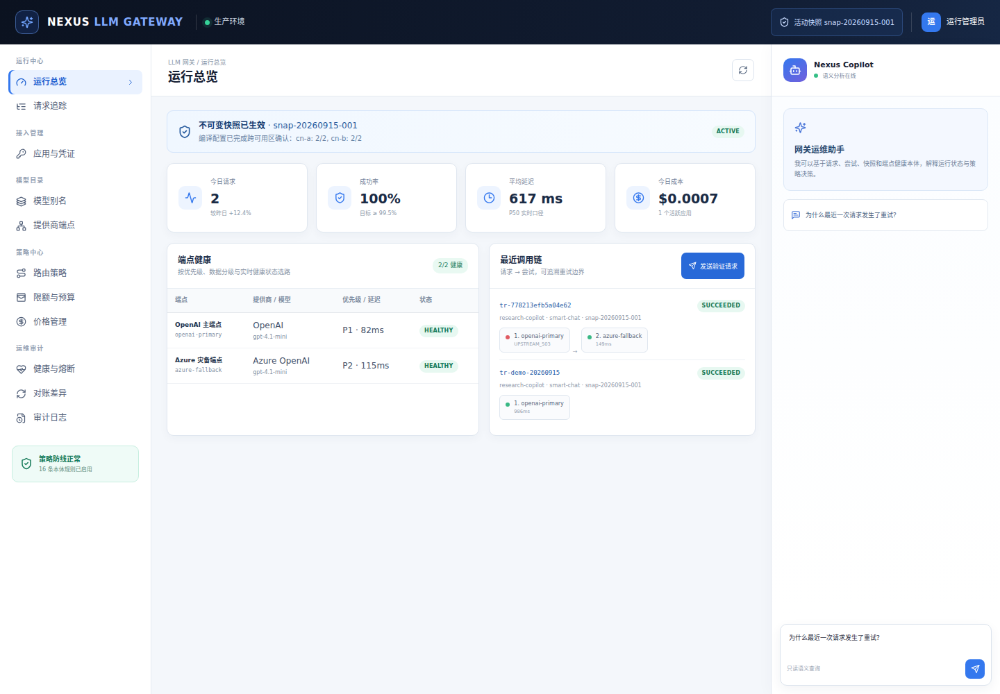
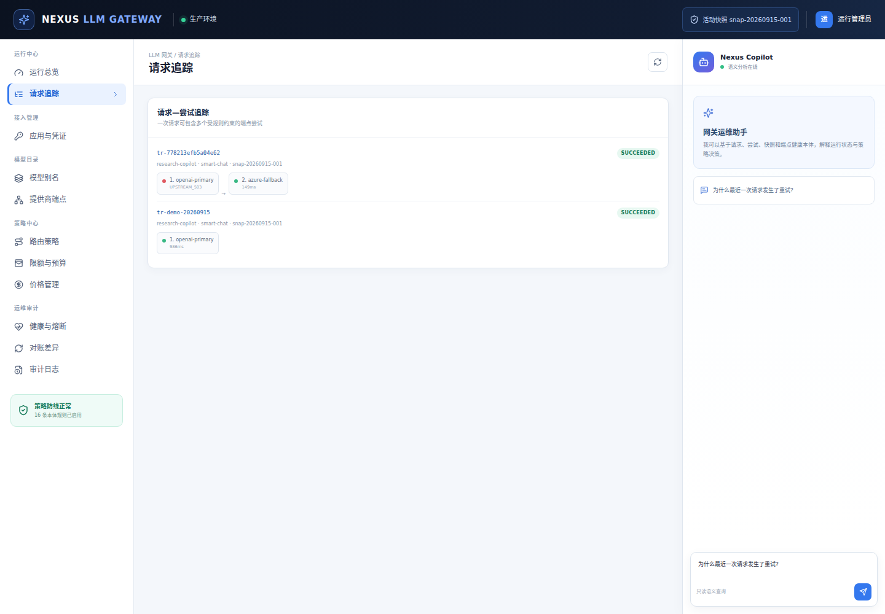
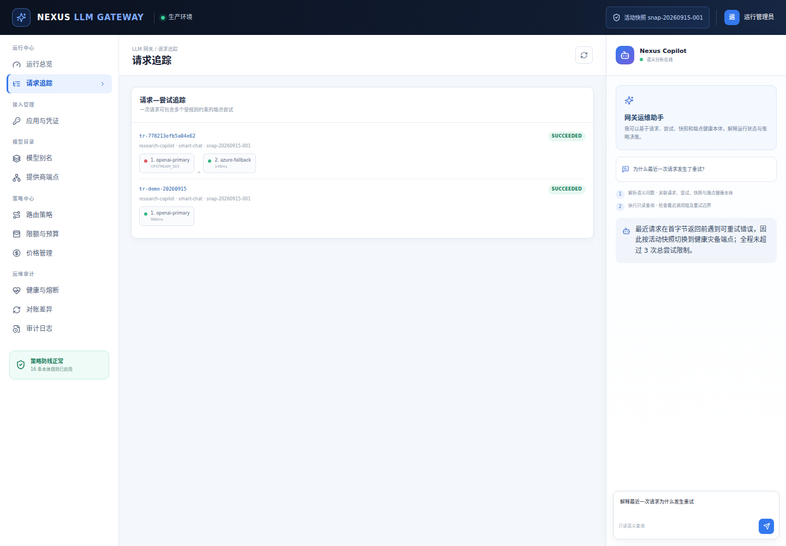

# Nexus LLM Gateway 测试报告

## 1. 测试范围

- 后端契约与规则单元测试。
- 策略创建、提交、双审批和快照发布集成链路。
- 网关身份、路由、首字节前重试、请求—尝试链、成本和审计。
- AI 助手命名 SSE 协议。
- React/TypeScript 生产构建。
- Chromium 真实浏览器主流程、控制台和网络请求检查。

测试日期：2026-09-15（Asia/Shanghai）。

## 2. 自动化结果

| 检查项 | 命令/方式 | 结果 |
|---|---|---|
| 后端测试 | `.venv/bin/python -m unittest discover -s tests -v` | 10/10 通过 |
| TypeScript 类型检查 | `npx tsc --noEmit` | 通过 |
| 前端生产构建 | `npm run build` | 通过，1558 modules transformed |
| API 健康与数据 | Flask 测试客户端 + 浏览器网络检查 | 通过 |
| 浏览器主流程 | Playwright CLI / Chromium 1440×1000 | 通过 |
| 浏览器控制台 | Playwright console errors/warnings | 0 error / 0 warning |
| AI SSE | `reasoning`、`answer`、`done` 事件断言 | 通过 |

后端测试覆盖：

1. 总览指标和活动快照；
2. 别名、提供商和端点目录；
3. 未审批禁止发布及安全→SRE→发布顺序；
4. 主端点失败后的两次尝试链；
5. 所有尝试失败后的请求、尝试链与审计持久化；
6. AI 助手命名 SSE；
7. 结构化审计查询；
8. 最多 3 次且仅首字节前重试；
9. 健康状态和数据等级候选过滤；
10. 生产敏感配置的环境变量覆盖。

## 3. 浏览器测试步骤与结果

1. 打开运行总览，确认活动快照、指标卡和双端点状态正常。
2. 点击“发送验证请求”，接口返回成功并展示 `traceId`。
3. 打开请求追踪，确认首个端点 `UPSTREAM_503`，第二个灾备端点成功。
4. 向 AI 助手提问“解释最近一次请求为什么发生重试”。
5. 确认助手展示推理步骤，并解释首字节边界和总尝试次数限制。
6. 检查所有 `/api/gateway/*` 请求为成功响应，浏览器控制台无错误和警告。

## 4. 测试截图

### 4.1 运行总览

### 4.2 请求追踪与主备尝试链

### 4.3 AI 运维助手

## 5. 已知边界

- 上游端点为确定性模拟，不产生真实模型费用。
- 端点健康状态参与选择，但 30 秒滑窗熔断状态机尚未连接分布式探针。
- npm 安装报告的第三方开发依赖告警未在本原型中自动升级，以避免超出技术底座兼容范围；上线前需执行依赖治理。
- 性能、长稳、故障注入和多节点快照分发测试不在本次快速原型范围内。
